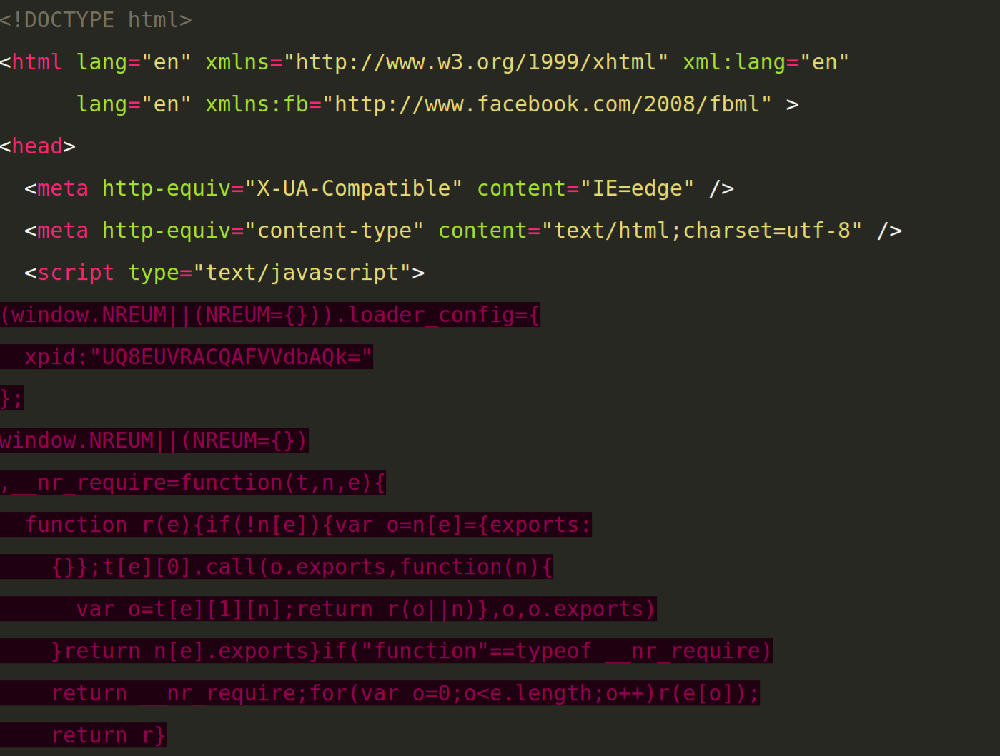

+++
title = "Benchmarking & Comparing Static Site Generators: Gutenberg versus Hugo"
date = 2018-07-02
+++

As of this post, this blog is now powered by the static site generator 
[Gutenberg](https://www.getgutenberg.io/) instead of [hugo](https://gohugo.io).
I was pretty happy about Hugo and don't have much bad to say about it, but
I'm even happier with Gutenberg.  This post provides an in-depth comparison 
between the two on five dimensions (speed, template syntax, features,
documentation/support, and hackability) and explains why I decided to switch.

## Speed
In some sense, this is the least important of the five metrics—both Hugo and
Gutenberg are fast.  Really fast.  So fast that, at least with small sites,
you'll likely never have a noticeable wait when using either program.

However, I'm still starting with speed because Hugo's tagline has always been
that it's "the world's fastest framework for building static sites", and I
really wanted to know if that's actually the case.  Hugo is constantly
bragging about it's speed, but Gutenberg is built in Rust which—at least to
hear the Rust partisans tell it—should give it a definite speed edge.  So,
who is the ultimate speed champion?

<!-- more -->

Well, it actually depends.  If you're generating a blog or other site 
**without** any code samples, then Gutenberg is the undisputed champion.  
When I ran a test on my blog with the most basic settings, Gutenberg built
the site in an average of 21.3 milliseconds, while Hugo took more than twice
as long, with a sluggish 54.5 milliseconds.  (See what I mean about both
being so fast that you'll never notice any difference?)

But, if I turn on syntax highlighting, Hugo edges to the lead again.
Syntax highlighting, you may recall, is what lets me have nicely colored
code samples like 

```html
<!DOCTYPE html>
<html lang="en" xmlns="http://www.w3.org/1999/xhtml" xml:lang="en"
      lang="en" xmlns:fb="http://www.facebook.com/2008/fbml" >
<head>
  <meta http-equiv="X-UA-Compatible" content="IE=edge" />
  <meta http-equiv="content-type" content="text/html;charset=utf-8" />
  <script type="text/javascript">
(window.NREUM||(NREUM={})).loader_config={
  xpid:"UQ8EUVRACQAFVVdbAQk="
};
window.NREUM||(NREUM={})
,__nr_require=function(t,n,e){
  function r(e){if(!n[e]){var o=n[e]={exports:
    {}};t[e][0].call(o.exports,function(n){
      var o=t[e][1][n];return r(o||n)},o,o.exports)
    }return n[e].exports}if("function"==typeof __nr_require)
    return __nr_require;for(var o=0;o<e.length;o++)r(e[o]);
    return r}
```

without styling all those colors by hand.  That's an absolutely _key_ 
feature for me, or for any technical blog.  And (with the amount of
syntax highlighting I had before this post), it slowed Gutenberg down
to 95.1 ms, but only slowed Hugo down to 84.7 ms.  So, at least in my 
typical use case, Hugo's claim to be the fastest stands up—but just by a
whisker.

But there's a complicating factor: Gutenberg's syntax highlighting is not 
slower because it's poorly coded, it's slower because it's **better**.  But
more about that when we get to the feature comparison. 

For now, I'll score this as a tie, and leave you with a full chart of my 
benchmark results.  

| Command | Mean [ms] | Min…Max [ms] |
|:---                                              |---:        |---:        |
| `gutenberg build` (without syntax highlighting)  | 21.3 ± 0.5 | 19.9…22.8  |
| `hugo` (without syntax highlighting)             | 54.5 ± 2.1 | 51.3…59.7  |
| `hugo` (with syntax highlighting)                | 84.7 ± 2.2 | 81.1…91.3  |
| `gutenberg build` (with syntax highlighting)     | 95.1 ± 5.0 | 90.3…109.2 |

Note that all of these benchmarks were taken with the
[Hyperfine](https://github.com/sharkdp/hyperfine) benchmarking tool, and
thus represent the average of multiple test runs.  Also note, of course, 
that these results are specific to both my site and my computer.  In
particular, my site currently has
[a lot](https://www.codesections.com/projects/codesections-website/) of
syntax highlighting, so it's entirely possible that Gutenberg might eke out
a win on a site with less syntax highlighting.

## Template Syntax
This is another area that could either be all important or totally irrelevant,
depending entirely on your use case.  It's entirely possible to use Hugo, 
Gutenberg, or any other static site generator entirely by selecting themes
built by other people without ever building your own theme or customizing 
an existing theme.  In that case, you don't need to care about the syntax 
at all.  However, if you do intend to customize a theme or if—like me—you 
want the control that comes from building your own theme from scratch, then
you'll spend a lot of time interacting with the template syntax.

Hugo's syntax was one of it's major pain points for me, and Gutenberg's is a 
big improvement.  Apparently I'm not alone: frustration with Hugo's template
language is one of the [main reasons that Gutenberg was built in the first
place](https://vincent.is/announcing-gutenberg/).

The issue here is that Hugo relies on the Go templating syntax, which means 
it relies on numerous conventions that may be second nature to someone coding
in Go every day, but that are pretty foreign to the rest of us. Conversely,
even though Gutenberg is written in Rust, it doesn't try to implement a 
Rust-specific template syntax.  Instead, it uses
[Tera](https://tera.netlify.com/).  As the Tera website says, "Used to Jinja2,
Django templates, Liquid or Twig? You will feel right at home"; Tera is
essentially a re-implementation of several popular and battle-tested 
templating languages.  As noted, this includes Liquid, which is the same 
templating language used by Jekyll, another static site generator known for
the ease of its templating system.  So, we should expect Gutenberg to have
a strong edge here.

But let's make this a bit more concrete.  

Here's a simple template from Gutenberg:

```Jinja2



  <h2>{{ page.title }}</h2>
  {{ page.content | safe }}

```

And here's the same thing in Hugo:

```go
{{ define "main" }}
  <h1>{{ .Title }}</h1>
  {{.Content}}
{{ end }}
```
Even though these two snippets are **very** similar, there are a few key 
differences—and they all come down to one philosophical difference: Gutenberg
is explicit where Hugo is implicit.  Gutenberg uses `` to mark a 
control structure, but `{{ code }}` to mark a template; Hugo uses `{{ code }}`
for both.  Gutenberg uses `endblock`, `endif`, `endfor`, and similar to end
various block; Hugo uses `end` for everything.  Gutenberg specifies the base
template that a particular template extends; Hugo applies a [complex set of
rules](https://gohugo.io/templates/lookup-order/) to automatically extend 
various templates.

All of these differences are minor, but they add up to a significantly 
different overall experience.  And, having tried both, the experience is 
a lot better with the Gutenberg/Tera/Jinja2/Liquid style.

## Features
This one is going to depend heavily on your use case: Hugo and Gutenberg 
share the same basic features, but both have features built in that the other
one lacks. Both (of course) parse Markdown into html; both support themes 
(though Hugo has more available); and both support using shortcodes as 
quick ways to, for example, embed YouTube videos (though, again, Hugo has
more pre-built ones available).  And both support basic syntax highlighting.

Hugo pulls ahead in a few areas (in addition to the better theme and 
shortcode selection): it has great support for multi-language sites
using full i18n.  And it lets you output content in as many formats as you 
like, including JSON or Google's Accelerated Mobile Pages format.  So, if you
need either of those, Hugo will have an edge.  Finally, Hugo also has slightly
better support for easily integrating external comments (e.g., Disqus) or 
external hosts—but neither is exactly hard to do manually.

On the other hand, Gutenberg has three key features that Hugo lacks, at least
out of the box.  Gutenberg can compile Sass files to generate CSS output.
Hugo doesn't have that functionality built in, though you can use [external
tools](http://danbahrami.io/articles/building-a-production-website-with-hugo-and-gulp-js/) to accomplish the same thing.  Similarly, Gutenberg will 
optionally generate an automatic search index; Hugo lacks that feature, but 
can implement it using [several external plugins](https://gohugo.io/tools/search/#readout).

(Note that the speed comparisons above didn't include either of these features, or the multi-language feature in Hugo.  All of these would slow down
site generation.)

The last feature where Gutenberg pulls ahead is syntax highlighting.  As I 
already mentioned, both Gutenberg and Hugo are capable of applying syntax
highlighting to any code samples, but Gutenberg is more capable.  Specifically,
[Gutenberg performs](https://github.com/Keats/gutenberg/issues/325) 
"context-aware highlighting", in contrast to Hugo, which only "highlights
keywords".

In practice, this means that Gutenberg is capable of applying different 
highlighting rules for in different situations.  Let's see this in action
by returning to example syntax highlighting I showed before.  As a refresher,
here's what it looks like with Gutenberg:

```html
<!DOCTYPE html>
<html lang="en" xmlns="http://www.w3.org/1999/xhtml" xml:lang="en"
      lang="en" xmlns:fb="http://www.facebook.com/2008/fbml" >
<head>
  <meta http-equiv="X-UA-Compatible" content="IE=edge" />
  <meta http-equiv="content-type" content="text/html;charset=utf-8" />
  <script type="text/javascript">
(window.NREUM||(NREUM={})).loader_config={
  xpid:"UQ8EUVRACQAFVVdbAQk="
};
window.NREUM||(NREUM={})
,__nr_require=function(t,n,e){
  function r(e){if(!n[e]){var o=n[e]={exports:
    {}};t[e][0].call(o.exports,function(n){
      var o=t[e][1][n];return r(o||n)},o,o.exports)
    }return n[e].exports}if("function"==typeof __nr_require)
    return __nr_require;for(var o=0;o<e.length;o++)r(e[o]);
    return r}
```

And here's what it looks like with Hugo:

[](hugo-syntax-highlighting.png)

As you can see, the Hugo version works fine on the HTML but totally fails
with the inline JavaScript.  That's because Hugo is looking for keywords but
doesn't have enough contextual awareness to know whether it's inside a 
`script` tag.  This is *most* noticeable when one language is nested inside
another, but shows up more subtlety in a few other ways—for instance, 
Gutenberg can correctly highlight the units in a CSS file, but Hugo can't 
tell the difference between `px` and any other uses of "px" in a file.

Of course, how much this feature matters to you will depend entirely on how 
much you want to highlight complex/nested code.

## Documentation/Support
Hugo and Gutenberg both have **excellent** documentation and support, but they
each have very **different** documentation and support.  Hugo comes with a 
somewhat overwhelming 22,400 lines of (English) documentation detailing 
just about anything you could possibly do with it (though, oddly, without 
*quite* as much detail on the confusing templating syntax as would be ideal).
If that's not enough, there's a [whole series of video 
tutorials](https://www.giraffeacademy.com/static-site-generators/hugo/),
and, if you have questions, you can turn to [numerous questions on Hugo's 
forum](https://discourse.gohugo.io/t/syntax-highlighting/10243) or on [Stack
Overflow](https://stackoverflow.com/questions/tagged/hugo).

Conversely, Gutenberg ships with a tightly organized but less comprehensive 
1,618 lines of documentation (though this doesn't count the [separate 
documentation](https://tera.netlify.com/docs/installation/) for the Tera
templating syntax Gutenberg uses).  This documentation is small enough that
you can easily read through it and get an understanding of the whole way
Gutenberg works.  On the other hand, if the documentation **does** leave you
with unanswered questions, you may well be stuck—you won't find video
tutorials, project forums, or a ton of Stack Overflow questions.  On the
[third hand](http://quotationsbook.com/quote/11809/), when researching this
post, I [opened an issue on
GitHub](https://github.com/Keats/gutenberg/issues/325), and the primary
maintainer got back to me almost immediately. 

So, depending on your outlook and preferences, either set of documentation 
could be a better fit.  But, by the standard of many projects, it's hard 
to go wrong either way.

## Hackability

How easy is it to improve each of the projects? I'd like to talk about this
from a couple different perspectives.  First, how likely is it that other 
people will contribute to either project, either to fix bugs or add new
features?

From this perspective, Hugo seems to have a real advantage.  It's currently 
the [third-most popular static site generator](https://www.staticgen.com/), 
with over 25,000 stars on GitHub.  In contrast, Gutenberg barely cracks the
top 40, with only 927 stars.  Similarly, Hugo has [already had contributions 
from 535 contributors](https://github.com/gohugoio/hugo), and 6 contributors
have made over 100 contributions.  Conversely, Gutenberg [has only 34 
contributors](https://github.com/Keats/gutenberg), and the lead developer is 
the only one who has made more than 10.  So, at least in the short term,
it seems certain that Hugo will see more and faster development, with more
eyes to fix bugs and develop features. 

As they say, [predictions are hard, especially about the future](https://quoteinvestigator.com/2013/10/20/no-predict/).  But I'm willing to bet that
this discrepancy continues: Hugo is written in Go, a language that's famously 
easy to learn and that [7.1% of developers already
know](https://insights.stackoverflow.com/survey/2018/#technology).  It seems
like Go has a lot of momentum behind it, and I'm willing to bet that
Hugo won't lack for contributors anytime soon.

Gutenberg, on the other hand, is written in Rust—which, despite being the 
[most-loved language](https://insights.stackoverflow.com/survey/2018/#technology) for the last three years in a row, hasn't (yet?) caught on with
a wider audience.  What's more, Rust is known for its long-ish learning curve,
so it seems unlikely that many potential contributors will pick it up simply
for the sake of submitting a quick patch to Gutenberg.  All in all, it seems
likely that Hugo will continue to see significantly more developer effort 
in the foreseeable future.

But that's only half the equation: What if you plan to make changes yourself,
rather than waiting/hoping someone else will?  Would it be easier to 
contribute to Gutenberg or to Hugo if you want to build your own feature 
(either as a contribution or a fork)?

Well, let's start with the obvious: If you know or plan to learn Go, it will 
be easier to hack on Hugo; if you know or plan to learn Rust, it will be 
easier to hack on Gutenberg.  But let's set that aside.  Assuming you know
both languages, which program would be easier to work on?

Well, just as Hugo has more documentation and more contributors, it also has
more code.  Way more code.  In fact, Gutenberg has just over 6,000 lines of 
Rust code, spread over ~50 files.  Hugo, by contrast, has over 50,000 lines
of Go code spread over 350 files.  Judging by size alone, the Gutenberg 
codebase seems far more manageable, and making meaningful contributions seems
far more feasible.  What's more, Gutenberg's code also seems to be well 
commented and well laid out, so it seems like contributions are entirely 
feasible.  If you know both Go and Rust, Gutenberg seems like the far easier
project to jump into.

## Conclusion: I'll be using Gutenberg

Based on all of the above, I could see a strong argument for Hugo.  It's
got more momentum, it's got more themes, and it's written in a growing 
language that would be easy to pick up.  But I think the case for 
Gutenberg is even stronger, at least for me.  It has features that 
are useful to me—especially the superior templating language and better
syntax highlighting.  And it seems to have more potential, given its
speed and the inherent advantages of Rust.  And, if there are issues
that others don't resolve, well that will just give me a reason to dive
in myself.


