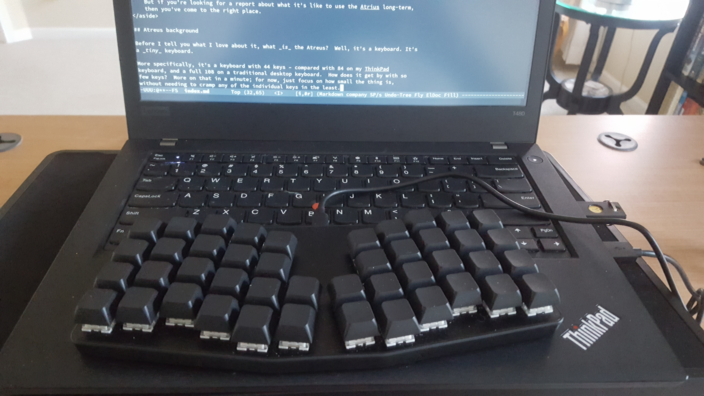

+++
title = "Open Source Keyboardio Atreus Keyboard – Six Week Review"
date = 2020-11-19
+++

As I write this, I've now had my Keyboardio Atreus for a full six weeks and have been
using it pretty much exclusively that whole time.  After a month and a half, I've given it
a fair shake and can give you my full impressions.  And my full impression is that it is
**amazing**.

<aside>

This review is **not** a detailed comparison written by someone who knows a lot about mechanical
keyboards.  I've heard that the Kailh BOX Brown switches in my keys are pretty good, but I
can't compare them to any other switches.  This is the first mechanical keyboard I've ever
owned – about all I can tell you about the keys is that it sure feels nicer to type on
than my ThinkPad keyboard.  If you're looking for that sort of comparison, you'll need to
[look](https://www.youtube.com/watch?v=R0mchmVeh4w) somewhere
[else](https://no-kill-switch.ghost.io/keyboardio-atreus-yeah-or-meh-review/). 
    
This also isn't a short, to-the-point, objective list of pros and cons.  It's less
Consumer Reports, and more [Down the Ergonomic Keyboard Rabbit
Hole](https://blog.scottlogic.com/2020/10/09/ergo-rabbit-hole.html) (though, tragically,
without the MS Paint illustrations).  As that post seems to prove, apparently at least
_some_ people like reading long, at times idiosyncratic, accounts of a really cool
keyboard setup.  This one is mine – well, mine and the Atreus's, I suppose.

(Though if you are here for brevity, I offer a one-sentence review at the very end.)
</aside>

## Atreus background 

Before I tell you what I love about it, what _is_ the Atreus?  Well, it's a keyboard. It's
a _tiny_ keyboard.

More specifically, it's a keyboard with 44 keys – compared with 84 on my ThinkPad
keyboard, and a full 108 on a traditional desktop keyboard.  How does it get by with so
few keys?  More on that in a minute; for now, just focus on how small the thing is,
without needing to cramp any of the individual keys in the least.

<!-- more -->

Just from that photo, you might notice a few other features of the Atreus.  First – and
unlike nearly every other keyboard in existence – its keys are arranged into columns
rather than rows: the `D` is exactly even with the `E` key above it, but isn't vertically
aligned with the `F` key to its right.  Both of these changes make the Atreus _far_ more
ergonomic to use.  Aligning the keys horizontally means that your fingers don't need move
diagonally nearly as often (a big contributor to RSI).  And moving the keys out of
horizontal rows aligns them more comfortably with the lengths of your fingers.  This
ortholinear layout is designed to make the Atreus significantly more comfortable and, more
importantly, to reduce the strain inherent in typing.

The other feature you likely noticed from the image is that my Atreus doesn't have any
letters on the keys.  That's not a requirement – they also offer the Atreus with keycaps
made out of "bright white PBT, which is dye-sublimated black and then laser-ablated to
reveal bright white legends".  As fancy as that sounds, I opted for the blank keycaps
because it helps with the Atreus's _other_ superpower.

Aside from its compact and ergonomic form factor, the Atreus's standout feature is its
full and easy customization.  You can set exactly what you want to happen on every key
press, whether that's sending a single key or executing a complex series of commands.  And
all of this happens at the firmware level on the keyboard – which means it Just Works™ on
any computer you might plug the Atreus into, without any software.

<aside>

And, trust me, if there were a computer that would put that Just Works claim to the test,
it'd be mine: I'm currently running an _extremely_ bare-bones [Void
Linux](https://voidlinux.org/) installation without many of the background processes that
software might reasonably expect on a "modern" operating system.  But the Atreus didn't
skip a beat and worked just as well as a totally standard, non-configurable USB keyboard.
Which, as far as the OS knows, is all it is.

</aside>

The Atreus actually offers two ways to customize the keys: A GUI configuration tool called
Chrysalis (shown below) and text-based configuration via Kaleidoscope. 

And all of this is powered by fully open source code.  The Atreus [began
life](https://atreus.technomancy.us/) as a DIY project by the noted Free Software hacker
and language designer Phil Hagelberg (aka [technomancy](https://atreus.technomancy.us/)),
and is now manufactured by Keyboardio; between the two of them, they've maintained an
admirable commitment to building the Atreus on free software.

So, now you know what the Atreus is: it's tiny, it's customizable, and it's fully powered
by free software.  But what's it like to actually _use_ the thing?

## How does it all fit?

Let's talk about the point I put off above: just how do you use a keyboard that
only has 44 keys?  Even if we're only typing English ASCII text, we need to be able to
type 26 letters, 10 numerals, and 30 special characters.  Simple arithmetic is enough to
show that those 66 letters won't fit into 44 keys in a straightforward way – and that's
without considering non-printing characters or modifiers.

But it's actually modifiers that make the Atreus possible.  A typical keyboard has four
(or more) modifiers: Ctrl, Alt, Left Shift, and Right Shift.  Many keyboards will have
more than one Ctrl key, but they'll _all_ have two Shift keys.  Why?  Well, as anyone who
has ever learned to touch type can tell you, there are two Shift keys so that you can hold
one with your right pinky when you type keys on the left side of the keyboard and can
hold the other with your left pinky whenever you type keys on the right side of the
keyboard.  If we only had one shift key to hit with our pinky, we'd have to contort our
hand mightily to enter capital letters on that side of the keyboard.

But we're only in that bind because we're forced to use our pinkies to hit the Shift
keys.  The Atreus moves that duty away from our weakest finger and to our strongest finger
– a finger that, incidentally, is ridiculously underused in a traditional keyboard
layout.  With the Atreus, you press the Shift key with your left thumb.  That means you
can press shift without moving your fingers out of position on the home row; moreover, in
combination with the Atreus's smaller number of keys, it means you can comfortably hold
the left shift key while pressing any other key on the keyboard.

That may not sound like a huge win – if all it does for us is get rid of the right Shift
key, then it just saves the Atreus a single key.  However, because the Atreus is
symmetrical, everything we just said about the left Shift key is equally true of the right
Shift key: you can also hold it while comfortably pressing every key on the keyboard.
Except we just said that we don't need a right Shift key.

Or, at least, we don't need a right Shift key that shifts us into typing capital letters.
Instead, we can use the right "Shift" key to shift us into a different set of characters
altogether.  This might sound a bit odd (and I acknowledge that it takes some getting used
to) but it's not really that different from how the Shift key works on a normal keyboard.
On a normal keyboard, you enter the `?` character by pressing `Shift` and `/` at the same
time; that's not because a question mark is somehow a "capital slash" (which, anyway,
sounds more like something a corporate raider would do than an item of punctuation).
Shifting into the other set of characters – the Atreus calls them Layer 2 – works just
like that, but for everything. 

That gives us up to an extra 43 effective keys to play with (since we're holding one key
down, we can't assign a new value to it), which would put us at 87 keys – already more
than my ThinkPad keyboard.  In practice, however, you probably don't want to assign a
different character for _every_ key; the default bindings leave 8 with their Layer 1
meanings, which leaves us with just 79 effective keys.  So we're still short of a laptop
keyboard, to say nothing of a traditional desktop one.

Talking about Layer 1 and Layer 2 has probably made the solution to this obvious: add a
Layer 3!  And that's exactly what the default bindings do, adding another 25 keys, which
brings us up to 104 effective keys and parity with a full desktop keyboard.

But how do we access Layer 3?  We could dedicate another thumb key to it (which is what I
do in my personal configuration), but the default bindings go a different direction:
instead of accessing the layer by holding a key, you toggle into it by pressing a key
(i.e., instead of being like Shift, it's like CapsLock).

## Ok, but why?!

At this point, you probably get the _how_ behind the Atreus's method for fitting 100+ keys
worth of functionality into just 44 keys.  But I wouldn't blame you if you're fuzzy on the
_why_.  Why go through all that trouble (and the learning curve of at least slightly
retraining your fingers) just to get back to the same number of keys that we started with?

Well, for some people, part of the appeal might be portability; Keyboardio even offers a
[travel case](https://shop.keyboard.io/products/keyboardio-atreus-travel-case).  It could
be the perfect keyboard to take with you when you work from a coffee shop, co-working
space, or other crowded public space!

<aside>

This would normally be where I'd have a line like "\*cough\* yeah, right \*cough\*" – but
I'm skipping it because I don't want you to think I might be sick.

</aside>
    
The Atreus really was first designed as an ergonomic keyboard that [you can take to local
coffee shops](https://technomancy.us/172).  But, even when coffee-shop-working was an
option, I was never interested in the Atreus for that sort of portability.  I like the
idea of a small keyboard for three reasons: ergonomics, consistency, and speed.

### Ergonomics

A big part of the reason I started looking at switching to a non-laptop keyboard is that
I'd started to experience a bit of discomfort after long stretches of coding.  Nothing
bad; nothing I'd even call pain.  But something noticeable, and I'm inclined to take even
a _hint_ of Repetitive Strain Injury very seriously – especially given how many [
programmers](http://ergoemacs.org/emacs/emacs_hand_pain_celebrity.html) have [dealt with
RSI](https://medium.com/@mdlayher/a-programmers-journey-with-rsi-c73628eed0c4).  And,
while there's a lot of disagreement about RSI, nearly everyone agrees that prevention is
far, far easier than cure.

If you take a look at [lists](http://xahlee.info/kbd/ergonomic_keyboards.html) of [best
ergonomic
keyboards](https://www.nytimes.com/wirecutter/reviews/comfortable-ergo-keyboard/), you
probably won't see the Atreus. Partly, that's because it's new, and a bit less mainstream;
it might not be on everyone's radar.  But even accounting for that, the Atreus is missing
at least a few features that the most ergonomic keyboard have – though it does have most
of them.  Here, have a chart comparing the Atreus, the
[Ergodox-EZ](https://ergodox-ez.com/), and the
[Dactyl](https://github.com/adereth/dactyl-keyboard).

| Feature                     | Ergodox | Dactyl | Atreus | 
|-----------------------------|:--------|:-------|:-------| 
| Mechanical keys             | ✓       | ✓      | ✓      |
| Split section for hands     | ✓       | ✓      | ✓      |
| Ortholinear layout          | ✓       | ✓      | ✓      |
| Fully split halves          | ✓       | ✓      | ✗      |
| Elevated middle ("tenting") | ✓       | ✓      | ✗      |
| Concave keys                | ✗       | ✓      | ✗      | 

So, given the Atreus's strong but definitely trailing showing on those traditional
ergonomic factors, why am I still enthusiastic about the Atreus as an ergonomic keyboard?

Well, it comes down to what each finger is being asked to do – or, put differently, it
comes right back to how tiny the Atreus is.  If you look at the [default layout of the
Ergodox-EZ](https://ergodox-ez.com/pages/getting-started), you'll see that each pinky
is responsible for **ten** keys, many of which involve the more-ergonomically harmful
diagonal movement.  Two keys (in the default layout, `=` and `-`) require stretching your
pinky two keys up and one to the side – at least for me, that'd be quite the stretch.  In
contrast, the Atreus asks your pinky to be responsible for only four keys, none of which
involve diagonal movement, and only one of which is more than one key away.

I know I'm harping on the pinkies a bit but, well, there's a reason some people call RSI
[Emacs
Pinky](https://skeptics.stackexchange.com/questions/17492/does-emacs-cause-emacs-pinky).
The pinky is, obviously, one of the weakest fingers, and asking it to do a lot is a fast
way to overtax your hands.  And some of those big stretches can be even more ergonomically
damaging if they end up pulling your hands out of position from the home row, resulting in
less ergonomic key strikes for other keys.

I'm not a doctor and I haven't been able to find any reliable research comparing these
different way to make keyboards more ergonomic.  So you definitely shouldn't take my word
for any of this.  But, having thought through the logic of the ergonomics, I've satisfied
myself that there's a strong case to be made for the Atreus as the most ergonomic
keyboard.  And, with data from my own n=1 month-long experiment (aka, anecdote), I can say
that the Atreus has totally put an end to the discomfort I was feeling - even as my daily
time typing has gone up.

### Consistency through portability

I said earlier that I'm not drawn to the Atreus as a keyboard to take to a coffee shop;
that's just not a use case I expect to have.  But there are three ways that the Atreus's
portability _does_ matter to me – all of which have to do with not needing to switch away
from the keyboard.

First, I don't want to stop using my laptop as, well, a laptop.  Sometimes, even the
scenery change of working from the kitchen table is really helpful.  Sometimes, working
from the couch just feels better – in fact, that's where I wrote a good chunk of this
post.  And when I did so, I continued to use the Atreus; I just picked it up, set it on
top of my laptop keyboard, and typed with the laptop on my lap.  There's just no way I
would have been able to pull that off with a larger keyboard.  To sit on the couch, I
would have had to switch back to the built-in keyboard.

Second, I do (or, anyway, did/will) travel a bit, including for work conferences.  While
traveling with a large split keyboard and finding a way to set it up in a hotel room is
probably a _bit_ easier than finding a way to use it from my lap, it still seems like
something that probably wouldn't be worthwhile.  But the Atreus is travel-friendly enough
that working from a hotel room shouldn't ever be a reason to fall back on the laptop
keyboard.

And, finally, though I _primarily_ use a single computer, I do occasionally use a
different one.  Sometimes I use an old mac I keep around for compatibility reasons;
sometimes, I need to do something on someone eles's PC.  Again, with a bulkier keyboard,
I'd probably handle these tasks with the built-in keyboard but with the Atreus it's easy
to just plug in.

All of these tasks, taken together, probably only add up to 10% of my computer use (ok,
maybe 20% if I have access to a really comfortable couch).  Yet that 10% makes a huge
difference to me because eliminating the last 10% of the time I might seriously use a
different keyboard frees me up to customize the Atreus beyond what I'd otherwise be
comfortable with.

You see, all of the keyboards I'm comparing allow for powerful customization – allowing
everything from switching to [Dvorak](http://xahlee.info/kbd/keyboard_dvorak_layout.html)
to [truly
personal](https://blog.scottlogic.com/2020/10/09/ergo-rabbit-hole.html#my-current-setup)
configurations.  But, whenever I've thought about adopting a more custom layout, I've
always been checked by the thought of growing dependent on it.  I'd hate to get a perfect
custom layout, and then be reduced to hunting and pecking on my laptop keyboard when
taking notes in a meeting.  And it'd be almost as bad if, anytime I asked to borrow a
friend's computer to send an email, I also needed to ask if they mind me installing an
alternate key layout on their system.  So, as tempting as custom layouts sound, I'd always
stuck more or less with QWERTY.

<aside>

I'm aware that some people are able to use a different layout without losing their QWERTY
proficiency.  But I'm sure I wouldn't be one of them.  Even the very minor change I made
to my ThinkPad keyboard layout – switching `CapsLock` and `Ctrl` regularly resulted in me
tyPING LIKE THis whenever I used a different keyboard.

</aside>

With how incredibly portable the Atreus is, however, I no longer have that concern.  I'm
now free to adopt whatever deeply demented custom layout works best for me (more on that
below) without worrying that I'll need to type much on standard layout.

### Speed

One concern I initially had was that the key combinations required to get full
functionality with only 44 keys would slow me down too much.  Before ordering the Atreus,
I got comfortable with the idea that I'd be willing to trade some raw speed for improved
ergonomics and customizability.

But, to my surprise, that was a trade I didn't need to make: typing most characters is
actually _faster_ with the Atreus than with a standard keyboard.

This surprised me, but it really shouldn't have.  After all, which is faster to type in a
QWERTY layout, `L` or `6`?  At least for me, typing the `L` is much faster even though it
requires pressing two keys instead of just one; pressing `Shift` and `l` really isn't
appreciably slower than pressing `l` alone, whereas stretching out to press `6` was always
slightly slower.  But with the default layout on the Atreus, typing `6` is exactly as
typing `L`.  The only difference is which shift key you press with your thumb.

That example is admittedly an extreme one: `6` is an especially long reach in the standard
layout, and not all keys can be relocated to under the home row.  But none of them are
relocated to keys that are particularly hard to reach because the tiny Atreus doesn't
_have_ any keys that are that hard to reach.  Within a month, my typing speed on the
Atreus passed where it was on a standard keyboard – and I can tell that I'm still in the
adjustment period.
 
## The end… of week 1

If this were a one-week review instead of a six-week review, it would end here.  I'd tell
you that, with the layout it ships with, the Atreus is ergonomic, portable, and fast; I'd
say that the portability was so impressive that I'm open to customizing the Atreus in a
way that I wouldn't be with keyboard that was more permanently affixed to my desk.

But, since this _is_ a six-week review, I can also tell you a bit about the actual
process of customizing the Atreus.

# My customization rabbit hole

<aside>

Note that my customizations are, well, custom: you probably won't want to make the same
(or even similar) choices.  I'll try to keep this section focused on the customization
process and other bits that are relevant to non-me people, but if you want to skip down to
[the flaws](#flaws), I promise not to hold it against you.

</aside>

The first step in customizing an Atreus is picking your tool: either the graphical
configuration tool (Chrysalis) or the textual one (Kaleidoscope).  I usually have a strong
preference for textual tools, but I made an exception for Chrysalis because being able to
assign commands to a visual representation of the keyboard makes deciding on a layout
about 10× easier and 100× more fun.

The very first thing I noticed about customizing the Atreus is the power.  You can of
course assign a key to any standard character.  But you can also assign it to a Macro (a
sequence of keys), or to something called a TapDance, or something else called a
SpaceCadet, among much else.

The feature that caught my eye, however, was something much less fancy but even more
useful (at least to me).  Specifically, the ability to have a key send a character when
pressed but act as a modifier when held.  As soon as I saw this, I immediately 
rebound the two thumb keys that are bound, by default, to `Alt` and `Ctrl`.  After that
change, the `Alt` key still acted as `Alt` when held,but was `Esc` when tapped;
similarly, the `Ctrl` key is still `Ctrl` when held but is `Enter` when tapped.

If this had been the only change I'd made to the default configuration – as, indeed, it
was for several days – I would still consider the Atreus's customizability to be a huge
win.  This one change fixes the biggest issue I have with the Atreus's default layout: it
requires you to stretch your pinkies two keys down to press `Esc` (on the left) or `Enter`
(on the right). And both of those are *incredibly* common keys (er, at least if you use
Vim keybindings, in the case of `Esc`).  Having to reach to press those two keys does a lot
to reduce the Atreus's benefit on your pinkies – but with one change, we've fixed that
issue entirely. 

But that's **not** the only change I've made to my layout; far from it, in from it.  In
fact, part of what I most like about customizing the Atreus is how easy it makes applying
minor changes to your layout.  I know they're more ergonomic and efficient, but I've never
been willing to make the jump to one of the non-QWERTY layouts.  The transition was always
a bit too much of a hurtle; I never had the time to pay the up-front cost of slow typing
that would have come from a wholesale conversion.  But this keyboard lets me gradually
evolve my layout in that direction by changing just a few keys at a time.  It'll take a
bit longer, but I'll get to the same place in the end – and _without_ paying the cost of a
wholesale layout change. 

## Flaws

As enthusiastic as I am about the Atreus, it certainly isn't perfect.  Here are the four
issues that have bugged me the most so far.

### The pinky keys are wrong (for standard touch typing)

When learning to type, most people learn to put their left pinky on the `a`, and the other
fingers of their left hand on the `s`, `d`, and `f` and to use each finger to hit the key
above and below the key it rests on.

As I mentioned earlier, this arrangement is pretty awful, since it asks people to line
their fingers up horizontally – even though their fingers are different lengths.  One of
the big selling points for the Atreus is that it lines up the `asdf jkl;` home row keys
with the actual length of the respective fingers.

Or, at least that's what I thought – but that turns out to be true for every finger
**except** the pinky. 

The Atreus's pinky keys are only slightly lower than the ring finger keys, and are in fact
even with the index finger keys.  In contrast, the pinky _finger_ is much considerably
lower than the index finger and much lower than the ring finger.

When I first noticed this issue, I wondered if the problem was on my end.  All the _other_
keys were positioned so perfectly; was I somehow [holding it
wrong](https://www.urbandictionary.com/define.php?term=You%27re%20Holding%20It%20Wrong)?
Or were my pinkies just freakishly short?

Neither, as it turns out.  The Phil Hagelberg very helpfully replied that he designed the
Atreus with the idea that you'd hit the `q` and `p` keys with a diagonal motion from your
ring fingers instead of with the pinky extension from the traditional typing technique.
This means that, when your pinkies rest on the `a` and `;` keys, they're already fully
extended – they can't comfortably extend further up, but can more comfortably fold down to
hit the `z` and `.` keys.

I can understand the logic behind this decision, but I still don't like it: it's not what
I'm used to, and I don't love the idea of adding an extra diagonal movement to each ring
finger.  I really wish the Atreus had more aggressively staggered its pinky keys, for
example the way the [Kyria](https://blog.splitkb.com/blog/introducing-the-kyria) keyboard
does. 

<aside>

In partial defense of the Atreus, its layout is heavily inspired by the ergodox layout,
which has the same minimal pinky stagger.  I haven't found any proof that it's designed
around the same finger use, but I bet it is; there are certainly ergodox users
[complaining about the same
issue](https://www.reddit.com/r/ergodox/comments/dyejni/pinky_finger_ergonomics_on/).

</aside>

### The Chrysalis configurator is incomplete (for now)

As I mentioned, the graphical configuration tool is pretty great, and it's very helpful to
be able to see the key layout take shape as you build it.  But, at least currently, it has
some real limitations.

For example, the Atreus supports Macro keys (which execute multiple commands with a single
keypress), TapDance keys (which execute a different command depending on how many times
you press them), and Leader keys (which execute commands based on the key sequence pressed
after the Leader key).  Chrysalis doesn't fully support any of these features; it will let
you bind a Macro, TapDance, or Leader key, but that key won't do anything unless you use
Kaleidoscope to assign it a command.

And Chrysalis doesn't provide even that more partial support for some of Kaleidoscope's
more advanced features, such as
[MagicCombo](https://kaleidoscope.readthedocs.io/en/latest/plugins/MagicCombo.html),
[ShapeShifter](https://kaleidoscope.readthedocs.io/en/latest/plugins/ShapeShifter.html),
and [Unicode](https://kaleidoscope.readthedocs.io/en/latest/plugins/Unicode.html).  Nor
does it support community plugins like
[AutoShift](https://github.com/tiltowait/Kaleidoscope-AutoShift) or
[MacrosOnTheFly](https://github.com/cdisselkoen/Kaleidoscope-MacrosOnTheFly). 

<aside>

I'm especially excited to try out that last one, which lets you record arbitrary
keystrokes and then play them back (exactly like a Vim macro).  I love that feature in my
text editor, and having it available system wide sounds amazing.

</aside>

None of that is a huge deal – I haven't yet used Kaleidoscope, but it doesn't sound all
that hard to set up and I'm looking forward to trying out some of the more advanced
features when I have a bit more time.  But since I'd gone on about how great Chrysalis is,
I want to be clear that it's also pretty limited.

### The USB cord

I know that this may sound petty, but I'm counting the Atreus's USB cord as a flaw.
Specifically, the cord's prong and the angle of the port on the Atreus combine to take up
an extra ~1.5 inches of depth.  That may not sound like a lot (ok, that _isn't_ a lot).
But the Atreus itself is only ~3.7 inches, so the cord increases the overall desk space by
about 40%.

If the "desk space" is actually on a desk, then you're unlikely to care about the extra
space; but you may if you're using the Atreus on a crowded coffee table (a use case the
Atreus was expressly designed for!).  Personally, I've discovered that the extra room the
cord takes up is just enough to mean that the Atreus bumps up against my trackpad buttons
when I put it on my laptop.

As I said, calling this a flaw sounds pretty petty.  After all, the cord is a standard
USB-C cable, so ~$10 can get you a [90°
cable](https://nerdtechy.com/best-right-angle-usb-c-charging-cable) and solve the issue.
Still, though, much less than $10 would have let them use a 90° cable in the first place,
and I wish they had.

### No sculpted keycaps

If calling the USB cord a flaw was petty, then listing the lack of sculpted keycaps as a
flaw would be downright unfair.  So let's not call it a "flaw", but rather a "missed
opportunity".

Specifically, since the Atreus is available with blank keycaps (which don't need to be
rearranged to move the labels around) Keyboardio had the opportunity to offer blank
keycaps that are [sculpted such that your fingers hit the keys at a better
angle](https://thekeeblog.com/overview-of-different-keycap-profiles/#Uniform/Flat_vs_Sculpted_Profiles).

As with the USB issue, this is something that you can fix on your own for a [relatively
reasonable sum](https://pimpmykeyboard.com/dcs-pbt-blank-keysets/).  And I can understand
why they didn't add another option: Keyboardio is a small company, and I'm sure they
wanted to keep the process as simple as possible.

Still, it would have been great if they'd been able to offer the option, or at least the
option to order the Atreus without any keycaps for a slight discount.  That's
especially true because I imagine that many people will be considering both the Atreus and
the ErgodoxEZ, which [does offer sculpted
keycaps](https://ergodox-ez.com/pages/our-keycaps).  

<aside>

On the other hand, the Atreus is currently [priced at
$149](https://shop.keyboard.io/products/keyboardio-atreus) compared with the ErgodoxEZ [at
$270–$354](https://ergodox-ez.com/pages/customize) (depending on options).  So, if it's
just a question of price, you could get the Atreus, replace both the keycaps and the USB
cord, and _still_ come out under the cost of an ErgodoxEZ.

</aside>

# The bottom line

I've described a number of features – ergonomics, portability, and speed – that make me
love the Atreus.  I've also described its flaws, as I see them.  But I worry that
I've left out something essentials: I'm almost 5,000 words into this review, but I worry
that I haven't captured what makes the Atreus special enough for me to _want_ to write a
5,000+ word review.

What I've struggled to capture is that the _Atreus has differences in **degree** that are
large enough to transform into differences in **kind**_.

An analogy to software might be helpful, because the same phenomenon shows up there pretty
frequently.  Consider a set of software tests that run in 30 minutes.  If you speed them
up by 10%, that's a nice win but not a big deal.  If you speed them up by another 10%,
you'll see another modest win; the return is roughly linear. 

But if you speed tests up by 99.9% – so that they run in ~2 seconds – then the return is
suddenly and astoundingly non-linear.  Developers can now run their tests interactively as
they code each new feature rather than to test a large chunk of features.  Instead of an
incremental improvement in test times, you get a transformation that enables an entirely
new style of development.

For me, the Atreus has demonstrated similar non-linearities.  Usually a keyboard being
more portable is nice, but really only matters when I travel.  But the Atreus is _so_
portable that I can depend on always being able to use it and can thus customize it
without worry.  Usually a keyboard being small will save some space on my desk; but the
Atreus is _so_ small that I can nearly subconsciously reposition it for maximum comfort
over the course of the day, easily experiment with different positions, or even use it
propped on a book in my lap (my current favorite).

Most keyboards aren't customizable at all, but the Atreus is so customizable that I think
nothing of adding a new binding just to try it out and can thus evolve toward a better
layout instead of attempting to divine one from first principles.

So here's my one-sentence review: The Keyboardio Atreus – not perfect, but transformativly
amazing.
<!--stackedit_data:
eyJoaXN0b3J5IjpbMTc1MjgwMDgwOF19
-->