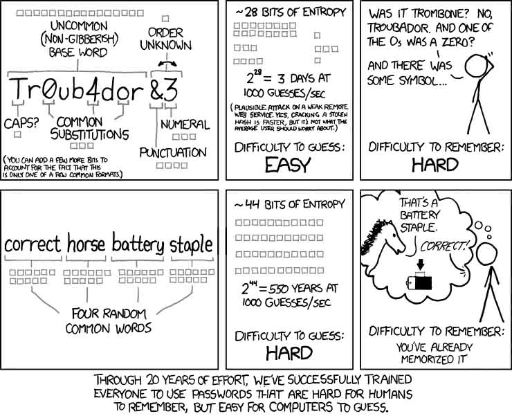

+++
title = "Fixing the One Problem With Password Managers"
date = 2018-06-03T11:43:27-04:00
+++

I recently tweaked the way I use my password manager, and it's already
saved me considerable frustration.  Not only that, it's also brought my
usage more in line with the Unix philosophy of using tools that do only
one thing, and do it well—and illustrated, once again, why that philosophy
is so great.

This post explains my tweak, and how you can apply it.  But first, some
background.

<!-- more -->

## Password managers
I love password managers like Pass, 1Pass, KeePass, KeePassXC, LastPass (ok,
I'm sensing a theme here—and awarding zero points for creative naming!).

As Troy Hunt, the mad genius behind [HaveIBeenPwned](https://HaveIBeenPwned.com),
is fond of writing, [The only secure password is the one you can’t
remember](https://www.troyhunt.com/only-secure-password-is-one-you-cant/).
That is, if you can remember a password, then
it's probably too short to be secure.  If it's not, it might well be 
[one you've used before](https://xkcd.com/792/)—which 
is even worse, since it means someone who figures out one of your passwords 
suddenly has access to much more of your digital life.  So if you want to
avoid insecure passwords, you basically have to make a record of your
passwords.

And that basically means using a password manager to store an encrypted
vault containing your passwords.  If you pick a good password manager, you can
have it automatically generate a secure password for you, and automatically
type that password in whenever you log in.  Instead of struggling to remember
whether your password is 123qwe or 1q2w3e (both in the [top 25 most-used 
passwords](https://www.huffingtonpost.com/entry/2016-most-common-passwords_us_587f9663e4b0c147f0bc299d), by the way), you're using 
a bulletproof password like [F^EHHtSIbPyDm2&kHsPhSppNYwzQDg](https://kevq.uk/are-password-managers-worth-it/).  
<strong>And</strong> you're having that password filled in for you 
automatically, without any memory struggles at all.  It's really great.

## The Problem
It's really great … right until it's not.  And then it's really, really, not.  As anyone who's used a password manager can tell you, eventually autofill 
will fail you.  Maybe you need to log in on a computer or mobile device that 
doesn't have your passwords synced to it.  Maybe you have to use a service that
[idiotically disables autofill in your
browser](https://www.troyhunt.com/the-cobra-effect-that-is-disabling/).
Maybe you'll be on the
phone with tech support on a spotty cell connection during a hail storm.  And,
when you are, you'll really wish you could tell them that your password was 
`qwerty` instead of `F^EHH`&#8203;`tSIbP`&#8203;`yDm2&k`&#8203;`HsPhSp`&#8203;`pNYw`&#8203;`zQDg`.

What you'd really like is to have a password that is just as
secure as `F^EHH`&#8203;`tSIbP`&#8203;`yDm2&k`&#8203;`HsPhSp`&#8203;`pNYw`&#8203;`zQDg` without being
anywhere near as difficult to type (or shout during that hail storm).
Fortunately, this is a famously solved problem:

[](xkcd_936.jpg)

All you need to do is to use passphrases consisting of simple words 
chained together, creating something long enough to be secure while 
understandable enough to be easy to remember for long enough to type in.  If 
you're as paranoid as I am, you'll throw in some special characters, 
capitalization, or numbers, too, so that your final password is something like 
`2222@`&#8203;`Correct@`&#8203;`Horse@`&#8203;`Battery@`&#8203;`Staple`.  That's just as secure as the 
unpronounceable password up above, and way easier to shout during a hail storm.

Of course, you really don't want to be inventing these sorts of passwords on
your own.  For one thing, humans aren't that good at randomness; for another,
that just sounds like a lot of work.  Fortunately, you don't have to: Bart
Busschots has put together [an online tool](https://xkpasswd.net) that
automates generating passwords like that (with
user-configurable settings about how many words, numbers, and special
characters to use).  I don't know why any of the top password managers haven't
incorporated a system like this into their password generating code (although
KeePassXC, to its credit, does let you generate a passphrase), but no
matter what password manager you use, you can go to that site, get your
passwords, and then save them to your preferred password vault. 

## It gets even better
If that was the best we could do, it'd be pretty great: we'd trade some
inconvenience when we generate the password (when we're likely not time
constrained) in return for much greater convenience when we enter the password
without autofill.  But, with the right password manager, we can do
**much** better than that—and we can do it in a way that
exemplifies the advantages of the [Unix philosophy](https://en.wikipedia.org/wiki/Unix_philosophy) of having programs serve one, and only one, function.

Specifically, we can take advantage of the fact that Bart Busschots—in
addition to running the website mentioned above—released a very Unix-y 
[Perl script](https://www.bartbusschots.ie/s/publications/software/xkpasswd/)
that generates the same sort of passwords, right from the command line.  I won't go through the details of how to set up or configure the Perl
script, in part because Bart already lays out the details in [two
excellent](https://www.bartbusschots.ie/s/2015/08/22/using-the-hsxkpasswd-terminal-command-part-1-of-2/) [blog posts](https://www.bartbusschots.ie/s/2015/09/06/using-the-hsxkpasswd-terminal-command-part-2-of-2/).  Suffice it
to say that, after following those directions, you can configure his script to
produce exactly the sort of password you'd like, whenever you type
"hsxkpasswd" in your terminal.  (Or, if you agree that that's too many
consonants in a row to reliably remember, whenever you type whatever you've
aliased it to; I picked "xckd-pass").

Now that we have a command line tool to generate our passwords, we can feed
those passwords into our password manager … or at least we can if we have a
password manager that follows the Unix philosophy and plays well with standard
input.  Sadly, many of them don't.

## Meet "Pass"
Fortunately, there's a tool called [Pass](https://www.passwordstore.org/)
that bills itself as "the standard unix password manager".  This is a pretty
bold claim, especially for a program that was written in this century.  But, 
despite the pomposity, Pass seems to back up its claims with real performance. 

As Pass explains:
> Password management should be simple and follow Unix philosophy.
  With pass, each password lives _inside of a gpg encrypted file_ 
  whose filename is
  the title of the website or resource that requires the password. These 
  encrypted files may be organized into meaningful folder hierarchies, copied 
  from computer to computer, and, in general, manipulated using standard
  command line file management utilities.

That means we can use Pass without trusting it at all; all the encryption
is handled by GPG (the GNU Privacy Guard, which provides some of the best
crypto available anywhere).  It also means that we don't need to rely on any
external software to sync our passwords, but can sync them the same way we
would sync any other file.  (I use a git sever running on a Raspberry Pi, but
Github, NextCloud, Dropbox, or any other way of syncing files would work
too).

And, most importantly for our purposes, it means that Pass plays well 
with standard input.  Specifically, we can create a new username/password 
pair with the command "pass insert username", and then Pass will prompt us 
to type a password, and then to retype it to confirm.  This means that we can 
use pipe the output from hsxkpasswd into Pass.  We could do that directly, 
but we can simplify things with an _extremely_ simple shell script that
does this for us:

```bash
#!/bin/bash
NEWPASSWORD=$(hsxkpasswd)

if [[ $1 ]]; then
  echo -e "$NEWPASSWORD\n$NEWPASSWORD" | pass insert $1
else
  echo "Usage: pass-new <pass-name>"
fi
```

Once we have this script set somewhere in our path, we can just type "pass-
new [pass-name]" and have a xkcd-style password automatically saved in our 
Pass database.  And then, of course, we can access it with all the normal Pass 
commands, like "pass [pass-name] -c" to copy the password to our clipboard.

## Summing up
So, bottom line: What have we done, and what did we accomplish?  Well, we:

 * Installed and configured [hsxkpasswd](https://www.bartbusschots.ie/s/publications/software/xkpasswd/).
 * Installed and set up [Pass](https://www.passwordstore.org/).
 * Wrote some basic glue code to get them working together.

Having done all this, we can use a single command to create a new passphrase
and automatically add that passphrase to a password manager. That passphrase
is long enough—and contains enough special characters and numbers—to be just
as secure as any impossible-to-pronounce-or-remember password that our 
password manager might have generated but is still much easier to type in when
our autofill inevitably fails us.  And all this has been possible because two 
tools, written entirely independently, could be easily combined because both 
followed the Unix philosophy.

<asside class="note">
<strong style="margin-left: 30%">Room for improvement</strong><br>
All that said, I am not _100%_ satisfied with this setup.  The problem
is that hsxkpasswd is a Perl script and thus requires a Perl runtime.  This 
was fine a few years ago when Perl was more dominant and most people already
had it installed.  But it feels a bit heavy in today's 
world—personally, hsxkpasswd is the only reason I have Perl installed on my
current computer.  So, it would be really nice if there were a version of 
hsxkpasswd that was written in a more portable language—ideally bash, since 
that's what Pass is written in.  I'm currently playing with a bash script along
those lines, and may polish it up for public release if there's any interest.
**EDIT: Playing around led to [pass-gen](https://www.gitlab.com/codesections/pass-gen), which implements all my ideas and has now replaced the workaround described in this post.**
</aside>
