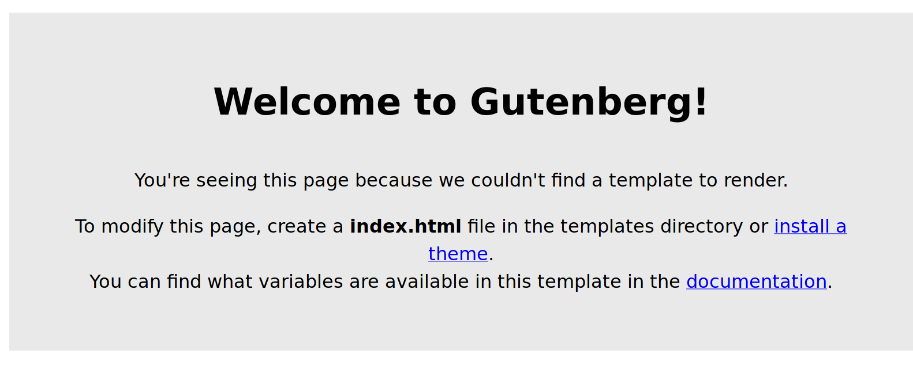
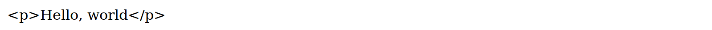
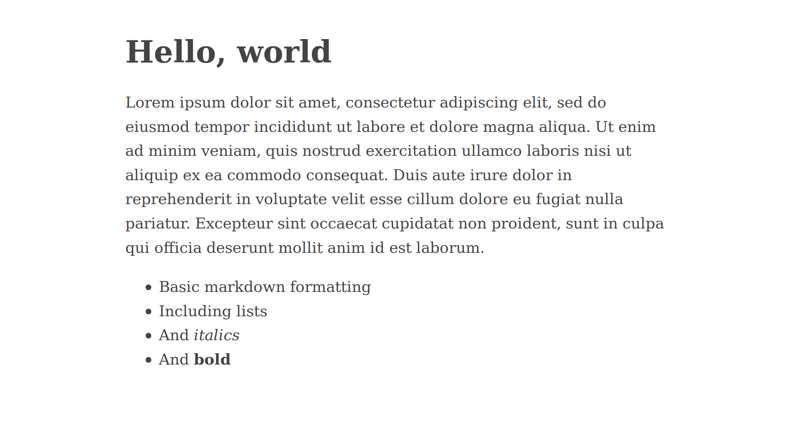
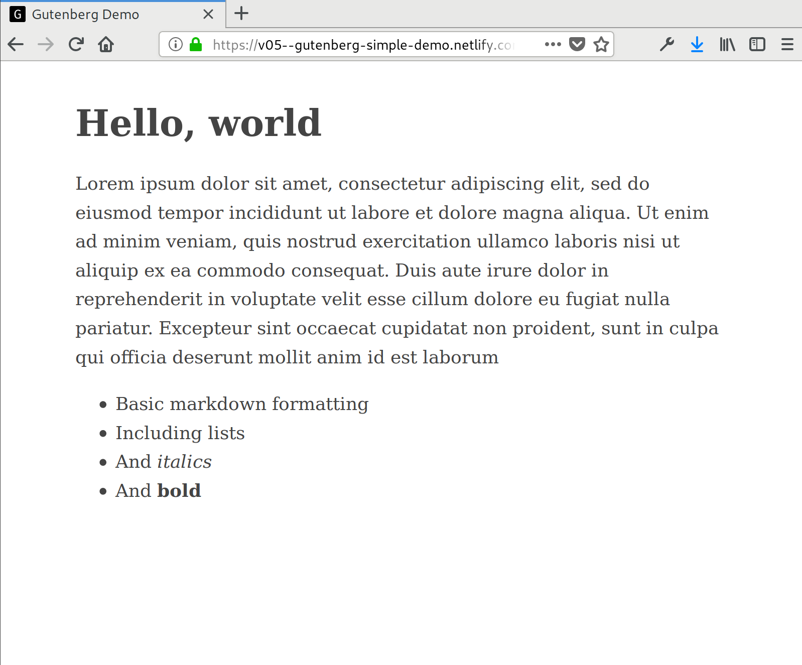

+++
title = "Gutenberg Quick Start: from 0 to Hello, World"
date = 2018-07-12
+++

Gutenberg is a fantastic static site generator.  It is likely the fastest 
generator in existence, it's got an easy-to-use yet powerful templating syntax,
and it supports advanced features like syntax highlighting and Sass compilation
out of the box.

This quick start guide will give you everything you need to know to build a 
custom static site, with your own templates, and taking advantage of all of
Gutenberg's powerful features.  At each stage, you'll be able to see demo
sites that show exactly what a site like the one I've described looks like, and
you'll be able to see the exact code that generated that demo site—it's all on
GitHub, and there'll be links at every step.

In this first part, we'll start with creating a simple, single-page site.  It
won't be much, but it will give us a firm foundation to build on.

<!-- more -->

## Installation and initialization
The first step, of course, is to install Gutenberg by following the 
[Installation instructions](https://www.getgutenberg.io/documentation/getting-started/installation/)
in its documentation.  

Once you've installed it, you'll have access to three new terminal commands:
`gutenberg build`, which will build output HTML and other static files for your
website, `gutenberg serve`, which will create a test server with live reload
(we'll use that a lot when testing our site), and `gutenberg init`, which 
starts a new site.

Lets use this last command now.  Navigate to the parent folder that you would
like to contain your Gutenberg site (in my case, went to `~/projects`).  Then
we need to pick out a name for our site; we'll be using `demo` in this example.

Run `gutenberg init demo`.  Gutenberg will ask you a few questions.  If you
have a domain name already picked out, feel free to provide it—but that won't 
matter until we deploy our site much later.  Answer `n` to all the other 
questions (we'll return to these more advanced features soon).

When you've finished, you should have a new folder.  Navigate to that folder, 
and you'll see a directory that looks like this:

```bash
  demo/
  ├── config.toml
  ├── content
  ├── static
  ├── templates
  └── themes
```

Now, run `gutenberg serve` and you'll get your first site.  Navigate to the 
URL, and you'll see it live!  (Admittedly, it's not—yet—all that impressive).

If everything has gone according to plan, you should see something like this 
(with this and all other screenshots, click for a live version)

[](https://v01--gutenberg-simple-demo.netlify.com/)


## Our first template
As you can see, we just got a placeholder template.  However, it tells us what
we need to do: make an `index.html` template.

So, navigate to the `demo/templates` folder and create a `index.html` file.  in
that file, type the following code:

```j2
{{ section.content }}
```

What does that do?  Well, Gutenberg uses the [Tera](https://tera.netlify.com/)
templating language, which has basically the same syntax as 
[Jinja2](http://jinja.pocoo.org/docs/2.10/),
[Liquid](https://shopify.github.io/liquid/basics/introduction/),
and [Twig](https://twig.symfony.com/) templating languages.  If you don't 
know any of those languages, don't worry—we'll cover all the essentials in 
due course.

For now, it's enough to know that surrounding words in `{{}}` lets you access
variables defined outside your template.  Specifically, `{{ section.content }}`
tells Tera to go to the current **section** and get the **content** of that
section.

So, what is the content of our section?  Well, we have to make it.  To do that,
navigate to the `demo/content` folder and create a new file called `_index.md`.

Type the following code into that file:

```md
+++
title = "Gutenberg demo site"
+++
Hello, world
```

What is up with the first bit, inside the `+++`?  Well, it's the 
"front-matter"—basically a way for you to include meta-data _about_ a page or
section without actually including the data in the section itself.

OK, now we have an `index.html` template, and an `_index.md` content page. 
Lets run our server command and see what we get.  If you're following along,
you should get something like this (again, click for the live site):

[](https://v02--gutenberg-simple-demo.netlify.com/)

And your code, minimal though it is, should [look like the code in this
branch](https://github.com/codesections/gutenberg-simple-demo/tree/v01).  Well,
sort of, anyway: your code won't have the LICENSE or README files, since those 
are there to explain the demo project; but your project _will_ have a couple
of empty folders—one quirk of git is that it typically [ignores empty 
folders)](https://stackoverflow.com/questions/3030230/does-git-ignore-empty-folders).

## Fixing our content
So, was that what you expected?  We got our content, "Hello, world", but we
also got something else, the printed `<p>` HTML tags that surround it.  Why 
did that happen?  It happened because Gutenberg is protecting us—whenever we
pass it HTML content, it will automatically _sanatize_ the HTML.  That is, 
Gutenberg will automatically prevent the HTML from rendering _as HTML_, and
will instead replace it with encoded characters that present the HTML as plain
text.  This is a nice default for a templating language to have (to prevent
[cross-site scripting](https://en.wikipedia.org/wiki/Cross-site_scripting)
attacks), but not really relevant to building a static site where we control 
all of our content.  So, how do we turn it off?

Pretty easily, as it turns out. What we need to do is edit our `index.html`
template to change `{{ section.content }}` to `{{ section.content | safe }}`.
This is our first **filter**, a command after a `|` that tells Gutenberg to
process the provided text differently.  In this case `safe` tells Gutenberg
_not_ to sanitize the text.

After that change, we get a site that looks like this (click for live site):

[](https://v03--gutenberg-simple-demo.netlify.com/)

## Adding some formatting
We've made it!  A (very) basic webpage saying "Hello, world".  But lets see if
we can make it at least a little prettier; lets add a tiny bit of CSS and 
Markdown formatting.

First, the CSS.  Lets open up our template and add seven lines of CSS.  And, 
while we're at it, lets add in enough HTML to generate an (almost) valid
page.  Change the `templates/index.html` page to have the following content:

```j2
<!DOCTYPE html>
<html lang="en">
  <head>
    <meta charset="UTF-8">
    <style>
      body {
        margin: 40px auto;
        max-width: 650px;
        line-height: 1.6;
        font-size: 18px;
        color: #444;
        padding: 0 10px
      }
      h1,h2,h3 {
        line-height: 1.2;
      }
    </style>
  </head>

  <body>
    {{ section.content | safe }}
  </body>
</html>
```

Now, open up the `content/_index.md` file and add it some Markdown-formatted 
text.  You can use all of the
[Markdown](https://daringfireball.net/projects/markdown/basics) syntax, and
you can add any text you want.  Here's what I added:

```md
+++
title = "Gutenberg demo site"
+++

# Hello, world
Lorem ipsum dolor sit amet, consectetur adipiscing elit, sed do eiusmod tempor
incididunt ut labore et dolore magna aliqua. Ut enim ad minim veniam, quis
nostrud exercitation ullamco laboris nisi ut aliquip ex ea commodo consequat.
Duis aute irure dolor in reprehenderit in voluptate velit esse cillum dolore
eu fugiat nulla pariatur. Excepteur sint occaecat cupidatat non proident, sunt
in culpa qui officia deserunt mollit anim id est laborum

 *  Basic markdown formatting
 *  Including lists
 *  And _italics_
 *  And **bold**

```

With those two changes, we're starting to get something that at least 
resembles an actual website:

[](https://v04--gutenberg-simple-demo.netlify.com/)

As always, click for the live site, and visit the [relevant
branch](https://github.com/codesections/gutenberg-simple-demo/tree/v04) of
the GitHub repo for the code.

## Final touches
We need to make two additional changes before we can declare our "Hello, world"
site done.  First, we need to add a title to our page, which is required to 
have a valid HTML5 document.  This should be old-hat by now: just open up the
`index.html` template and add in the title tag.  When you're done, it should
look like this:

```j2
<!DOCTYPE html>
<html lang="en">
  <head>
    <title>Gutenberg Demo</title>
    <meta charset="UTF-8">
    <style>
      body {
        margin: 40px auto;
        max-width: 650px;
        line-height: 1.6;
        font-size: 18px;
        color: #444;
        padding: 0 10px
      }
      h1,h2,h3 {
        line-height: 1.2;
      }
    </style>
  </head>

  <body>
    {{ section.content | safe }}
  </body>
</html>
```

Finally, we should add a favicon, one of those little pictures that shows up
in the tab bar.  This isn't **stictly** required, but it sure helps our site
look a bit better and it will let us see the process for uploading static
files.  

Since we don't have a favicon of our own, let's borrow Gutenberg's.  I've 
[saved a copy of the file](https://raw.githubusercontent.com/codesections/gutenberg-simple-demo/v05/static/favicon.ico) to the GitHub repository.  Go
ahead and download it now, and save it to `static/favicon.ico`.  Having
done that, what else do we need to do? 

Nothing!  Fire up your server, and you should see something like this:

[](https://v05--gutenberg-simple-demo.netlify.com/)

How does this magic work?  To understand this, let's talk a bit about how 
Gutenberg generates your site.  At a big-picture level, it takes all the files
in your `content` directory, processes them according to rules in your 
`templates` directory (including by parsing Markdown files into HTML), and 
then places the output files in your `public` directory.  Next, it also places
all the files in the `static` directory directly into `public`—without 
processing them at all. 

Thus, when we put `favicon.ico` in the `static` directory, and then ran the 
`serve` command, it was copied directly into the `public` directory and was
immediately available to our generated site.

## Conclusion 
So, that's everything you need to know to build a very basic site with 
Gutenberg.  Once again, feel free to look at any of the live demo sites we 
built today ([v1](https://v01--gutenberg-simple-demo.netlify.com/),
[v2](https://v02--gutenberg-simple-demo.netlify.com/),
[v3](https://v03--gutenberg-simple-demo.netlify.com/),
[v4](https://v04--gutenberg-simple-demo.netlify.com/),
[v5](https://v05--gutenberg-simple-demo.netlify.com/)), or to check out the
[source repository](https://github.com/codesections/gutenberg-simple-demo/tree/master), which has the code for each version in separate branches.

In the next part of this tutorial, we'll walk through how to add multiple 
pages to your site, including how to manage multiple templates in a way that's
powerful and maintainable.
