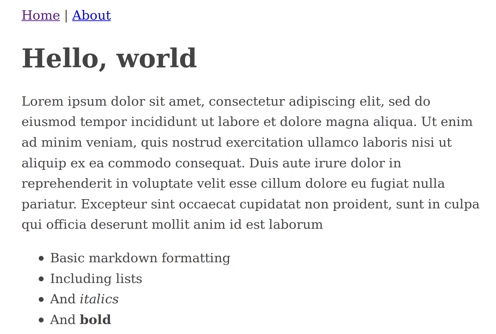
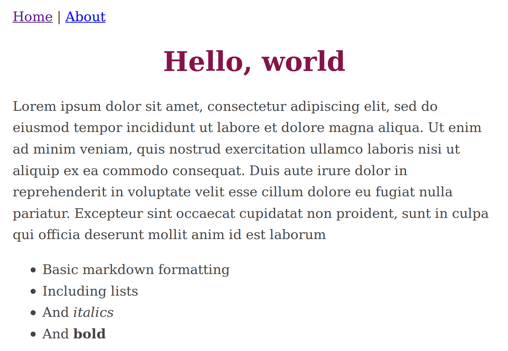

+++
title = "Gutenberg quickstart 2: From \"Hello, World\" to macros"
date = 2018-07-24
+++

When we left of, we'd just created a "Hello, World" website—nothing that fancy,
but enough to get a feel for the basic structure of Gutenberg's templating
system.

[](https://v05--gutenberg-simple-demo.netlify.com/)

([source code](https://github.com/codesections/gutenberg-simple-demo/tree/v05), as always, in the GitHub repo.)

Today, we're going to dive in a bit deeper and take a look how we can use 
Gutenberg's templates to support a multi-page site.

## An About page
First, let's create an About page for our demo site.  Before we do, though, 
lets add a link to our new page from our homepage.  Add the following HTML to
your `index.html` file just after the body begins:

```html
    <nav>
      <a href="/">Home</a> | <a href="/about">About</a>
    </nav>
```

Now that we have a link, lets make the page.  To do that, we'll need a 
template that applies to pages—right now, we only have the `index.html` template
but, as we talked about last time, that template *only* applies to the home page.

By default, all other pages are governed by the `page.html` template.  (Note
that I said *pages*, which are distinct from *sections*.  We'll get to sections
next time.)  So, if we're going to have an About page, we're going to need a 
`pages.html` template.

<!-- more -->
To create one, simply copy your `index.html` template over to `pages.html` and 
make one change.  Change the line `{{ section.content | safe }}` to `{{ 
page.content | safe }}` since we want the content of the page rather than of a
section.

Next, we'll need some content.  To create that content, navigate to your 
`content` directory and create a new `about` folder.  Inside this folder, create
a file called `index.md` and give it this content (or something similar if you
want to experiment):

```md
+++
title = "About"
+++

Some details about this site.
```

<aside>
  You could skip creating the `about` folder and just create the file as
  `about.md` in your `content` directory.  Either way would create a page on 
  your site that lives at `[BASE_URL]/about`.  The advantage of creating the
  `about` folder is that you can put images or other related files in that 
  folder and then easily link to them, which will be helpful as your site grows.
</aside>

And that's all it takes to have a second page up and running.  Fire up your 
local server with `gutenberg serve` and you should get something like this,
with working links:

[](https://v06--gutenberg-simple-demo.netlify.com/)

([Source code](https://github.com/codesections/gutenberg-simple-demo/tree/v06))

## First refactor
While that definitely *worked*, there's a lot about it that should have just
about any experienced web developer cringing.  Most notably, we have two 
separate templates that are literally copies of one another with only a single
*word* changed between them.  This is about as blatant a violation of [don't
repeat yourself](https://en.wikipedia.org/wiki/Don%27t_repeat_yourself) as
you could ever hope to find.

So, let's fix that.  And, in the process, we'll get to know another set of 
Gutenberg's key features: base templates, extends, and blocks.

To implement this, create another copy of `index.html`.  (Yes, I know we're 
trying to *reduce* the amount of copying, but just bear with me.)  You can
name this one whatever you like, so long as it has an `.html` extension.  I'll
go with `base.html`.  Then, replace everything inside the body tag with 

```j2


```

What does that do?  It creates a `block` that has the name "content".  What 
this means is that any other file can extend `base.html` and substitute in 
content inside that block.

Let's set that up now.  Delete all the text in `index.html` and replace it
with the following:

```j2



  {{ section.content | safe }}

```

You may be able to guess what this does: it tells Gutenberg that you want to
extend the `base.html` template, and that it should substitute in the stuff
inside the "content" block for the "content" block in `base.html`.

A few points are worth noting here:
 *  the `extends` line must be the first line in the template.  As a direct
    consequence, a template may only extend one parent template.
 *  However, you can chain extensions—that is, another template could extend
    `index.html` even though `index.html` is extending `base.html`.
 *  Templates can have more than one `block`.  For example, I will frequently
    have at least three block in my `base.html`: `page_speciffic_css`, 
    `content`, and `page_specific_js`.  That lets me easily add in any of 
    those elements if necessary in a child template. 
 *  Blocks can have default values in the parent template.  For instance, 
    if you had put "Hello, World!" inside the "content" template in
    `base.html`, then that text would be displayed whenever you extended 
    `base.html` but *did not* provide replacement text for the "content" 
    block. 

Let's make the same changes in `page.html`.  Just like with `index.html`, we
can delete the entirety of our current text and replace it with 

```j2



  {{ page.content | safe }}

```

We haven't changed our rendered HTML at all—as you can confirm with 
`gutenberg serve`, but we've moved our source HTML into a single file, which
will make it much easier to maintain.

## Dealing with the CSS
While we're refactoring, let's deal with the CSS.  This tutorial isn't about
coding CSS, so we won't refactor the actual code.  But let's at least get it
out of a `<style>` tag mixed in with our HTML.

Now, at this point there are two directions you could go.  The more standard
way to go would be to replace your inline CSS with a `<link rel="stylesheet">`
tag and put our CSS in an external file.  Gutenberg supports going this route, 
and even comes with built-in support for compiling your CSS from Sass files.  
If you want to do this, just create `.sass` or `.scss` files in your `sass` 
directory.  Then, during site build, those files will be automatically compiled
to your static directory and can be linked from your HTML files.  If you want 
more information on going that route, the
[docs](https://www.getgutenberg.io/documentation/content/sass/) are
helpful as always.

However, in this guide I'm going to demonstrate going another way.  We're going
to include CSS inline in our built file, but break it out into a separate file
in our source.  This gives us most of the advantages of splitting our CSS out
into a separate file—we separate our concerns, and we can link the same CSS
file from multiple HTML pages—without paying the cost of additional HTTP 
requests that can unnecessarily slow down sites load their CSS with external 
requests.  The only disadvantage to this approach is that CSS isn't cached, 
which matters for sites loading large quantities of CSS (e.g., 
[bootstrap](https://getbootstrap.com/)) but doesn't matter at all when we're 
loading only a KB or so.

Now that we've picked our approach, how do we do it?  Simple.  We move our 
CSS into a separate template file, which I'll call `css.html`.  So that file
should look like this:

```css
body {
  margin: 40px auto;
  max-width: 650px;
  line-height: 1.6;
  font-size: 18px;
  color: #444;
  padding: 0 10px
}
h1,h2,h3 {
  line-height: 1.2;
}
```

(Depending on your text editor, you may need to tell it to apply CSS syntax
highlighting to this file.)

Then, replace the CSS that was in your `base.html` with the single line 
``.  Including files really is that easy.

If you'd like to see the source code for where we are now, it's in the 
[GitHub repo](https://github.com/codesections/gutenberg-simple-demo/tree/v07).
You can also check out the [live site](https://v07--gutenberg-simple-demo.netlify.com/), though note that it won't have changed at all.

## Even better system for CSS
I wanted to show you how to `include` files because it's simple, useful, and
good enough for many use cases.  But I also want to take a moment to explore
`macros`, which are far more powerful and are one of Gutenberg's killer
features.  In fact, I recommend using macros to handle your CSS.

But first, let's make our CSS just a *little* more advanced so that we can
see the power of macros when dealing with our CSS.  Lets add a bit of CSS
that applies only to our homepage, not to our About page.

Imagine you want the following CSS to apply to the homepage:

```css
h1 {
  text-align: center;
  color: #85144b /* maroon */
}
```

Now, we *could* do this with includes—we could put this in a separate file, 
and then `include` it in our `index.html` file, but not in our `base.html` 
file or our `page.html` file.  But, though this would work, it could get a
bit messy—we'd need to artificially split our CSS into separate files even 
when, as in this case, the size/complexity doesn't justify it.

Luckily, macros give us a better option.  Here's what you do: rename `css.html`
to `css_macros.html` (optional, but recommended).  Then, update it to have
the following content:

```j2

  body {
      margin: 40px auto;
      max-width: 650px;
      line-height: 1.6;
      font-size: 18px;
      color: #444;
      padding: 0 10px
			    
  }
  h1,h2,h3 {
    line-height: 1.2;
  }




  h1 {
    text-align: center;
    color: #85144b /* maroon */
  }

```

Then revise your `base.html` file to look like the following:

```j2


<!DOCTYPE html>
<html lang="en">
  <head>
    <title>Gutenberg Demo</title>
    <meta charset="UTF-8">
    <style>
      {{ css::global_styles() }}
      
      
    </style>
  </head>
  <nav>
    <a href="/">Home</a> | <a href="/about">About</a>
  </nav>

  <body>
    
    
  </body>
</html>
```

As you can see, it now starts with an `import` line, which imports the macro
and then calls the macro inside the `<style>` tag.  It also now has a second
block, a possibility we mentioned above.

Finally, update your `index.html` file to the following:

```j2




  {{ css::homepage() }}



  {{ section.content | safe }}

```

And now, launch the live site.  If all goes well, you'll have a site that's 
only slightly changed from when you were using includes, but that is now 
powered by the full strength of macros.

[](https://v08--gutenberg-simple-demo.netlify.com/)


  Why are macros better than includes here?  A few reasons:
  *  **Explicit dependencies**: using macros puts all your `import` statements in a single location at the top of your code.  Conversely, `include` statements are scattered throughout your file, which can make it harder
     to see what's there.
  *  **Namespacing**: Notice how we called both of our CSS macros using the prefix `css::`?  Macros give you a built-in way to namespace your functionality without needing to rename files or created a more complicated directory structure. 
  *  **File organization**: As mentioned, macros give us the freedom to organize our files however makes sense for the scope of our project.
  *  **Power**: We're not using the full power of macros here—they can become much more powerful and flexible when you start passing in arguments.  Getting used to macros in this simple case will help when you need their more powerful features. 


## Conclusion 
Ok, that's it for now.  We've gone from a single-page, single template site
to a multi-page site making full use of multiple templates, separate CSS files,
and the power of macros.  Next time, we'll dive into sections and look at
iterating through Gutenberg pages—we'll add a blog to our example site.

