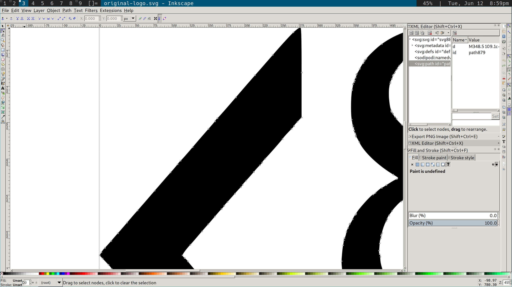

A few months ago, I got very into maximizing the speed of my website.  I feel 
pretty good about what I accomplished: 


(I actually prefer the results from [webpagetest.org](https://www.webpagetest.org/result/180612_B9_3853bf53a2703c0582863edfd1f34791/), and not just because it show my site as loading even faster.  It's open-source and seems to have a better methodology.  But it doesn't generate as pretty a picture, so I went with the Pingdom screenshot above.) 

My home page loads in well under a second, and transfers only 2.4kb of data.  All of the pages in my site loaded their above-the-fold content without any blocking scripts or external CSS.  Plus, my site is served of of Netlify's global CDN, so it attains basically the same speed for visitors from anywhere in the world.  I was generally satisfied with that result, and stopped thinking much about my site speed.

Then, today, I realized that I'd let things slip a bit; I'd uploaded a few 
images without giving any thought to compression, and a couple of pages were 
much larger—and therefore slower—than they had any right to be. 

So, I decided to fix that.

<!--more-->

## From .PNG to inline .SVG

The first step was to deal with the codesections logo on the [blog home page](/blog).  This logo, as you might have noticed, is a section symbol surrounded by angle brackets: <§>.  To render that image, I'd lazily used a PNG file I had lying around from a previous project.  At 27kb, it wasn't that large for a PNG file, but it was much larger than it needed to be and—since the logo is at the top of the page—meant that the above-the-fold content for my main blog page could never load in the first round trip of data sent by the server. (Due to a [quirk of the TCP protocol](https://tylercipriani.com/blog/2016/09/25/the-14kb-in-the-tcp-initial-window/), only 14kb of data are sent in the first round trip.)

So, I need to get that image a lot smaller.  The first step is to switch from the PNG file I'd lazily inserted and to an SVG. If you're not familiar with SVGs ([Scalable Vector Graphics](https://en.wikipedia.org/wiki/Scalable_Vector_Graphics)), here are the basics: An SVG is a recording of an image that tells the computer how to draw it using shapes and lines.  So to draw a black circle, you might have an SVG [like this](https://developer.mozilla.org/en-US/docs/Web/SVG/Element/circle):

```html
<svg viewBox="0 0 100 100" xmlns="http://www.w3.org/2000/svg">
  <circle cx="50" cy="50" r="50"/>
</svg>
```

This contrasts with JPEG and PNG files, which (to grossly oversimplify), store information about the color of each pixel in the image.

All this means that, at least for simple images, there's the possibility that an SVG can take up far less space—if it can describe a few simple shapes, it can create the same image with less data.

So, my first task is to get the logo as an SVG instead of a PNG.  I happen to also have an SVG version of the logo, so this task is easy—and, as an added bonus, it gets me a better-looking version of the logo too. So, we've gone from this image:

 

which takes up 28 kb of data, to this image:


Which takes up "only" 9.8kb.  But 9.8 is still way to large a fraction of our ~14kb budget.  How can we get it down further?

Well, after opening up this image for editing in Inkscape (a free-as-in-freedom SVG editor) and zooming in, we see something like this:



If you look closely, you should be able to see a whole mess of grey boxes in that screenshot.  Each one of those is a "node", and each one represents us telling the computer to draw a line from one point to another.  Looking at how many nodes we have, it's clear what's going on: We're telling the computer "draw a straight line.  And then another. And then another …" and on and on.  We could be much more efficient if we just told the computer "draw one long straight line".  And so that's exactly what we'll do.

Lets pause, first, to ask how the SVG got this way in the first place.  Why is the straight line in that angle bracket being represented as dozens of little lines instead of the one long line it should be?  This almost certainly happened because the SVG was created by converting a PNG or JPG to SVG.  The line in the PNG wasn't perfectly straight—it was close but, pixels being square and all, it wasn't quite 100% straight.  So, the SVG conversion did it's best to approximate the almost-straight line by joining a series of straight lines.  

But we can do better than that.  We know that the line really is straight, so we can delete all the nodes except for the first and the last and tell Inkscape to draw a line just from the first to last.  And, although it's a bit more complicated, we can do the same with the curves as well.  After deleting the relevant nodes, we can get down to this:


This image is now down to 2.6kb.  Is that the best we can do?  

Not quite. 

## Hand-editing SVG files

Remember how I said that an SVG is literally telling the computer to draw lines and shapes?  And remember the example of the plane black circle?  What that showed us was that SVGs are really just text files, which means we can open them up as text files and edit them by hand.  

If we open up this latest SVG, here's what we get:

```svg

<?xml version="1.0" encoding="UTF-8" standalone="no"?>
<svg
   xmlns:dc="http://purl.org/dc/elements/1.1/"
   xmlns:cc="http://creativecommons.org/ns#"
   xmlns:rdf="http://www.w3.org/1999/02/22-rdf-syntax-ns#"
   xmlns:svg="http://www.w3.org/2000/svg"
   xmlns="http://www.w3.org/2000/svg"
   id="svg4"
   viewBox="0 0 697.000000 697.000000"
   height="929.333"
   width="929.333"
   version="1">
  <metadata
     id="metadata10">
    <rdf:RDF>
      <cc:Work
         rdf:about="">
        <dc:format>image/svg+xml</dc:format>
        <dc:type
           rdf:resource="http://purl.org/dc/dcmitype/StillImage" />
        <dc:title></dc:title>
      </cc:Work>
    </rdf:RDF>
  </metadata>
  <defs
     id="defs8" />
  <path
     style="fill:#000000;fill-opacity:1"
     id="path2"
     d="M 291.7501,128.4998 C 259.12035,154.45085 252.33043,196.38614
     268.2,229.7 c 11.12395,20.29793 32.32727,29.24885 40.80011,37.54985
     -36.56595,16.77496 -57.53011,44.33155 -59.25002,85.50003 -1.77838,
     64.12102 56.47868,91.467 99.00003,111.75004 39.87151,11.6827 
     56.99316,62.95427 29.25001,96.00003 -8.28965,12.60803 -52.14788,
     18.05768 -60.60013,-4.19995 -21.73612,-76.01451 -86.49645,-28.5634
     -40.6499,24.44996 37.74022,20.30559 82.86095,23.41328 120.75004,-1.5
     19.44032,-14.39791 39.56987,-47.70337 36.75001,-81.00003 -5.53921,
     -34.28839 -21.4429,-44.78456 -49.50002,-66.00002 61.99383,-32.5635
     74.45652,-124.43646 21.75001,-155.25006 C 364.5592,249.90487
     307.64442,232.63183 300.75011,196.74982 290.8481,145.89728 325.9521,
     132.17336 357,132.2498 c 29.40633,1.41536 33.74607,31.8798 41.25014,
     45.75002 31.72169,28.76918 39.619,-12.37961 34.50001,-27.00001 C 
     415.26091,98.989802 327.84563,104.77506 291.7501,128.4998 Z m 
     69.7500,292.5001 C 268.95774,381.01565 271.30101,320.71831 331.5,
     279.24985 c 100.47547,9.35417 81.67411,111.46981 30.00013,141.75005
     z M 0.75000026,347.49988 C 42.664217,395.84147 168.85857,539.80643 
     207.75007,581.49996 c 0.37902,-33.59273 0.82917,-57.36989 0.75,
     -94.50003 -41.88686,-46.67619 -85.69273,-96.55522 -123.00004,
     -139.50005 37.58387,-49.87042 85.61892,-98.45817 123.00004,
     -143.25005 0.63705,-16.36965 -0.56839,-81.03471 -1.5,-93.00004
     C 136.89127,195.44151 71.521089,271.04919 0.75000026,347.49988
     Z M 487.50017,111.9998 c -0.49348,32.0443 -0.0766,56.35026 
     -1.7e-4,90.75003 38.75787,45.35593 96.72358,111.80538 123.75021,
     143.25005 C 568.4583,396.8741 526.8563,446.06682 487.5,490.74993
     c 0.91441,10.6116 1.72887,82.29659 1.50017,90.75003 C 544.01547,
     518.88602 633.62692,420.84172 696.75024,345.99988 645.15898,
     287.19487 534.88535,164.32884 487.50017,111.9998 Z" />
</svg>
```
That's certainly a lot more complex than our circle example!  But even without parsing the whole SVG syntax, we can make a few observations right off the bat.  First, we can see that the top of the document contains a lot of metadata—data that we may be able to cut if we don't need to record that much information.  

Second, we can notice that the numbers in the long block of text are **really precise**.  In most of the numbers, we have 8 decimals of precision—far more than we're likely to need, especially considering that we're planning to use this image as a header in our logo.

So, lets edit our file to remove that precision and strip out some of the metadata we don't need.  What does that leave us with?

```svg

<svg height="175" width="175" viewBox="0 0 700 700" >
  <path d="M 291,128 C 259,154 252,196 268,229 c 11,20 32,29 40,37 -36,16
  -57,44 -59,85 -1,64 56,91 99,111 39,11 56,62 29,96 -8,12 -52,18 -60,-4 
  -21,-76 -86,-28 -40,24 37,20 82,23 120,-1 19,-14 39,-47 36,-81 -5,-34 
  -21,-44 -49,-66 61,-32 74,-124 21,-155 C 364,249 307,232 300,196 290,145
  325,132 357,132 c 29,1 33,31 41,45 31,28 39,-12 34,-27 C 415,98 327,104
  291,128 Z m 69,292 C 268,381 271,320 331,279 c 100,9 81,111 30,141 z M 
  0,347 C 42,395 168,539 207,581 c 0,-33 0,-57 0,-94 -41,-46 -85,-96 -123
  ,-139 37,-49 85,-98 123,-143 0,-16 -0,-81 -1,-93 C 136,195 71,271 0,347
  Z M 487,111 c -0,32 -0,56 -1.7e-4,90 38,45 96,111 123,143 C 568,396 526,
  446 487,490 c 0,10 1,82 1,90 C 544,518 633,420 696,345 645,287 534,164
  487,111 Z" />
</svg>
```

At this point, we've reduced the file size down below a single kilobyte—in fact, we've gotten it down to only 817 bytes.

We can pull one final trick, however: we can "inline" the SVG; that is, we can include it directly into our HTML instead of linking it as an external file.  This has two advantages.  First, it means that our page has one fewer HTTP request to make, which further speeds up page load time.  Second, it means that we can compress the text of the SVG at the same time we compress our HTML—which means we can compress both a little bit more.  It's always easier to compress a longer file than to compress two shorter files, since there will be more repetition and textual compression thrives on repetition.

So, we now have our image into the page, and have done so in a way that takes up hardly any space at all—less than one-twenty-eighth of what we started with.  We've achieved an ~97% reduction in storage space devoted to the image, and can declare victory.

At least, we can declare victory over the images that can be converted to SVGs. In the next post in this series, I'll talk about how I'm compressing the images that **can't** be converted to SVGs, including all the JPGs in this post itself.
