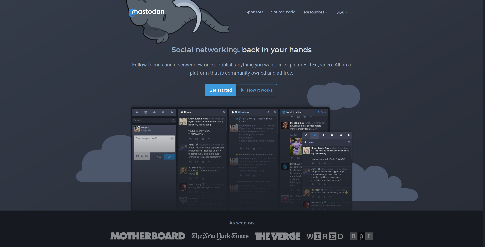

+++
title = "Mastodon Is Better than Twitter: Elevator Pitch"
date = 2018-07-26
+++
Mastodon is a newcomer social media platform that is a lot like Twitter—short 
messages, followers, hashtags, all that.  But Mastodon is much better than Twitter,
and not just because being totally ad-free and keeping chronological timelines make
it far more enjoyable to use (though that certainly helps!).  

All that is nice, but the real advantage Mastodon has over Twitter is that
Mastodon is **not** an [outrage machine that's corroding our ability to view
our politic opponents as real humans, deserving of sympathy and 
understanding](http://shamusyoung.com/twentysidedtale/?p=41853).

To explain how much better Mastodon is, I'm going to give you three examples of
**how** Mastodon is better, and then I'll step back and talk about **why**
Mastodon is better.

<!-- more -->

## From Retweets to Boosts
One of the most pernicious parts of Twitter is how people will retweet something 
dumb, offensive, or awful that an opponent said, along with a message mocking that
opponent.  Over time, this leads people on all sides of an issue to see only a 
distorted caricature of their opponents, comprised of an amalgam of all the worst
features of that group.  (This phenomenon of cherry-picking the worst bits of an 
opposing group [exists independently of
Twitter](http://slatestarcodex.com/2014/05/12/weak-men-are-superweapons/), but
Twitter makes it much, much worse.)

How does Mastodon solve this issue?  Well, Mastodon doesn't have retweets; it has 
"boosts".  Boosts are essentially like retweets, with one key difference: there's 
no option to add your own commentary.  You simply *can't* post something awful with
a message saying how awful it is—all you can do is boost something awful without
commentary.  What's more, the name itself—"boost"—draws attention to a fact that 
Twitter does its best to obscure: by boosting something you disagree with, you're 
ultimately giving that viewpoint *more* exposure, not less.

As a result, Mastodon users basically never boost toots to say how wrong they are,
and there isn't an issue with armies of followers descending on the original author.

## Mastodon Is Local (while still being global)
With Twitter, everyone belongs to a single, global Twitter, with a single set of 
moderation policies spanning every group individual on the service.  If you get
banned from Twitter, you're banned from *all* of Twitter.

With Mastodon, you don't really join Mastodon itself.  Instead, you join a particular 
server (called an "instance").  Your instance might have a few hundred people and a 
moderator or two—just the right scale to keep the discussion civil without degenerating
into bureaucratic rules-lawyering.  And, because you get a "local" feed of all posts
on your instance in addition to posts from people you follow, your instance really 
can start to feel like a community.  Finally, with instances, you keep control: if you
find that you don't like the moderation policies or culture of a particular instance,
you're always free to pick up and move to a different one.

This neatly solves Twitter's huge problem with moderation—as Mastodon grows, the 
number of mods will inherently scale with that growth.  Yet, even as their number
grows, they'll stay part of (and accountable to) a relatively small community on their
home instance.

Of course, Mastodon would be pretty useless if it only let you talk to a few hundred 
people, so it doesn't impose that limit at all.  You can follow *anyone*, regardless
of what instance they call home.  The only difference is that if you have a problem 
with them, then you'd complain to *their* instance's moderators rather than to your 
own.

So what stops people from setting up instances that allow for any sort of awful content
and then pestering the rest of us?  Well, they *can*, but Mastodon lets you or your 
moderators decide to block entire instances.  If a particular instance won't mind its
own users, then it will likely find that few other instances want anything to do with 
it—or at least that it's limited to equally laissez-faire instances.

## A User Interface that Encourages Thoughtfulness
Mastodon's user interface provides the very prominent option to hide a portion of
a post behind a screen that is only removed when and if the user chooses.  This is a
great format for hiding the punchline in jokes or concealing spoilers.  More 
importantly, it's also commonly used to hide controversial posts—including posts about
politics.

What this comes down to is **control**.  This pattern of tagging politics and letting
the reader decide whether they want to engage with them puts the reader back in control;
they can chose to engage with politics—and many do!  But if they don't want to (or 
don't want to right now), they also have the option not to view those posts.  And
that's not the only way the Mastodon UI puts the reader back in control; for example,
it also has very powerful options for hiding toots based on keywords to give you a
middle ground between unfollowing someone and seeing every toot they ever make.

Now, I acknowledge that some of this is just a cultural practice; having political toots
hidden is dependent on Mastodon users recognizing how corrosive political discussions
can be and opting to give their readers control over when and if they see those toots.
But it's a cultural practice that the technology nudges people towards with good
user-interface design, and it's a cultural practice that, at this point, is firmly
established.

## The Why: Twitter Is in the Outrage Business; Mastodon Isn't a Business
Twitter is a business that makes money (… er, *tries* to make money) by selling ads. 
To maximize ad revenue, they want to keep you on Twitter for as long as they possibly 
can, which means making sure their content is as engaging as possible.

But often, tweets are at their most engaging when they're at their most enraging.
Any tweet that keeps people clicking and talking—even if they're talking about how
awful the other side is—is a tweet that keeps people around to view ads.  Outrage
is good for Twitter's bottom line.

And that's why Twitter isn't—and will never be—as healthy a community as Mastodon is.
Mastodon's innovations aren't *technologically* that challenging (I mean, a lot of the
tech is pretty cool, but it's nothing Twitter couldn't copy if they really wanted to).
No, the reason that Mastodon has all these advantages is that they *aren't* advantages
from Twitter's perspective.  From Twitter's perspective, anything that makes people
less likely to angrily retweet a rival's obnoxious view is a loss, pure and simple.

And Twitter doesn't have any choice in the matter, either.  Even if they wanted to
sacrifice their ad revenues out of a desire to improve the quality of public discourse,
they couldn't.  Twitter is a public company, funded by investor money; they thus owe
a legal duty to make as much money for their investors as they can.  Twitter can't, 
and won't, stop prioritizing ad revenue.

Mastodon, on the other hand, isn't profit motivated and never will be.  At the top,
Mastodon is a small, open-source project [funded on
Patreon](https://www.patreon.com/mastodon).  Mastodon can afford to stay small, because
it's not trying to be centralized—the vast bulk of the work is being done by thousands
of small sys-admins across the globe running small instances of a few dozen or a few
hundred users.  And that part is sustainable too—running a small instance costs only a
few dollars a month, and is a rewarding gig: it comes with a lot of control, and a 
privileged position to help craft a healthy community.  Mastodon's entire model gets 
its incentives right.

## Joining
If this sounds at all appealing to you, I encourage you to check out Mastodon.  It's
not perfect, and it might not fully replace Twitter if you're a heavy user—if for no
other reason than that people you like to follow won't (yet) have switched.  But the
community is really great, and growing quickly.  And I've had a blast with it since I
got involved. If you'd like to join, the main website,
[joinmastodon.org](https://joinmastodon.org/), is full of good info. 
There's also a good tool for picking an instance available at
[instances.social](https://instances.social/).  

My recommendation is to use that tool to find a few relatively small instances with
names that sound interesting to you. Then, click through and read about the culture
and moderation policies of each instance and maybe scan through the public posts to
get a sense of the local vibe.  And then dive right in—you can always change your 
mind later.

On a personal note, if you happen to be interested in FOSS (Free and Open Source
Software), then I can personally vouch for the community at
[fosstodon.org](https://fosstodon.org).  And, on an even more personal note, whatever
instance you join, please feel free to look me up.  I'm
[@codesections@fosstodon.org](https://fosstodon.org/@codesections) and would love for
you to say hi.
