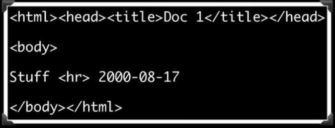
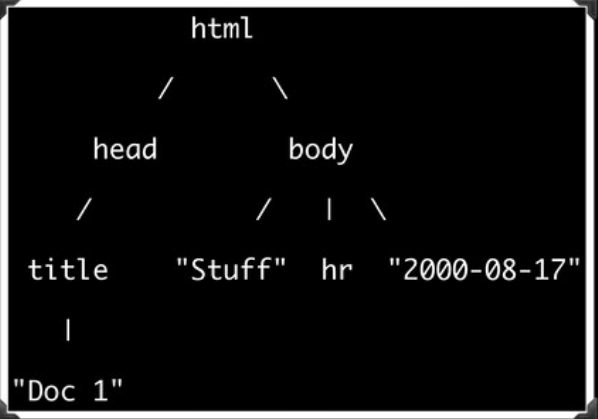

+++

title = "Peas in a Pod6"

date = 2020-09-09T07:55:24-04:00

+++

Maybe you already know this, but it took me *way* too long to realize it so I'm going to talk about it anyway: **Pod is not Pod6**.

<aside>

This post is entirely about the Pod6 documentation language. If you're not familiar with Pod6, it's a lightweight markup language that can be rendered to Markdown, HTML, plaintext, or a variety of other output formats; you can think of it a bit like a more powerful and flexible version of Markdown. It was originally designed to [make inline Raku documentation](https://docs.raku.org/language/pod) as pleasant as possible to write, but you can use it anywhere you might want to generate HTML or another output format – in fact, I've started [writing this blog](https://github.com/codesections-personal/codesections/tree/master/pod-src) in Pod6. There's even a dedicated [editor](https://zahatski.com/2020/7/22/1/podlite-open-source-pod6-markup-language-editor) for writing Pod6 and rendering realtime HTML output.</aside>

I want to be clear about what I'm *not* saying. My point isn't that Pod6 is a different language from [POD](https://perldoc.perl.org/perlpod.html), aka Plain Ol' Documentation, the markup language used for Perl 5 documentation. That's *true*, of course – Pod6 and POD are not the same language – but I'm making a different point.

The point I'm making is that Pod6 and Pod aren't the same language any more that JSON and JavaScript objects are the same language. In fact, Pod6 and Pod have a relationship that is exactly analogous to JSON and JavaScript objects: like JSON, Pod6 is a notation for writing plaintext files that can be read both by humans and machines; like a JavaScript object, Pod is an in-memory representation of that content.

Put differently, Pod6 is a **markup language**, and Pod is a **data format**. 

<!-- more -->

### Some code examples

Here's an example of Pod6:

```pod
=begin pod
Hello, B<world>!
=end pod
```

And here's some Raku code that reads that same Pod6, parses it into Pod, and then prints a textual representation of the Pod (*not* the Pod6).

```raku
use Pod::Load;

my $pod = load(q:to/EOF/);
    =begin pod
    Hello, B<world>!
    =end pod
    EOF

$pod.raku.say
```

If you run that code (or, you know, run the [tangled output](/blog/weaving-raku/) of this post's [source code](https://github.com/codesections-personal/codesections/blob/master/pod-src/peas-in-a-pod6.raku)), then you get the following output (some line breaks added):

```raku
$[Pod::Block::Named.new(
    name     => "pod",
    config   => {},
    contents => [Pod::Block::Para.new(
                   config   => {},
                   contents => ["Hello, ",
                                Pod::FormattingCode.new(
                                  type   => "B",
                                  meta   => [],
                                  config => {},
                                  contents => ["world"]),
                                "!"])])]
```

That is, the Pod – unlike the Pod6 – is a parsed data structure; it's an object, with attributes and methods; it's something that we can manipulate with the full power of Raku. In contrast, the Pod6 we started with was … a string.

So what?
--------

Ok, hopefully I've convinced you that Pod and Pod6 aren't the same thing. But why should we care? Is all this just an excuse for pedantry – a reason to be able to correct people's usage when they leave off (or add) a 6?

No. This isn't pedantry at all; it's actually a key way that Pod is better than Markdown.

We've gone from a flat string, to a fully parsed tree. As Bruce Grey [recently put it](https://www.youtube.com/watch?v=wZZtrtoTjt4) at the [Conference in the Cloud](https://tpc20cic.sched.com/event/cDdx/refactoring-and-readability-crouching-regex-hidden-structures), we've gone from this:



to this:



That is, we've gone from a flat structure that we'd have to parse before we can do anything useful with to an ordered tree that we can efficiently navigate, including recursively. As the images above illustrate, this is exactly the shift browsers make when they go from HTML to a DOM tree, and it's just as powerful for us as it is with browser front-end code. We can bring exactly the same sort of tree-manipulation logic to bear on our parsed Pod that powers DOM manipulation.

Now, Pod is hardly the only markup format that is paired with a in-memory tree data structure. Obviously, HTML is too, as are XTML and all of the many S-expression-based markup languages. So having access to our data as a tree is hardly a *unique* selling point for Pod.

But it is a selling point that sets Pod6 apart from Markdown, which is the main other markup format in wide use for Pod6's main usecases. Markdown simply cannot be parsed into a tree. Sure, you can parse it into HTML (sacrificing info in the process) and then parse the HTML into a tree, but that's hardly the same thing at all. In fact, Markdown has *no* canonical in-memory representation; it really is just a markup language.

So, if you want a markup format with the light weight of Markdown, but far more flexibility and with the power inherent being able to manipulate your markup as a tree, you may just want Pod.

Or rather, Pod6.
