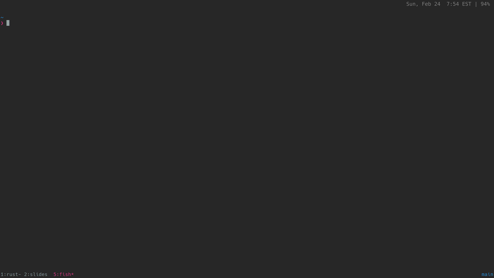
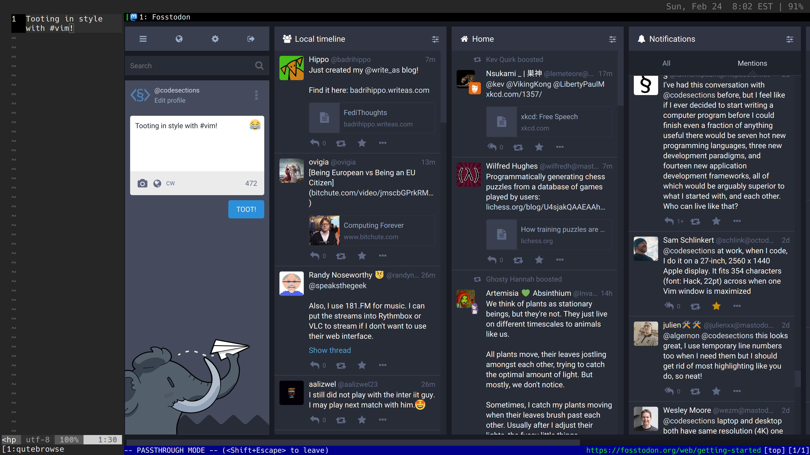
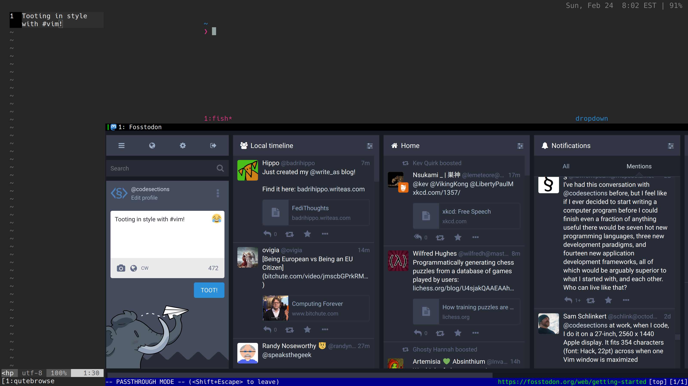
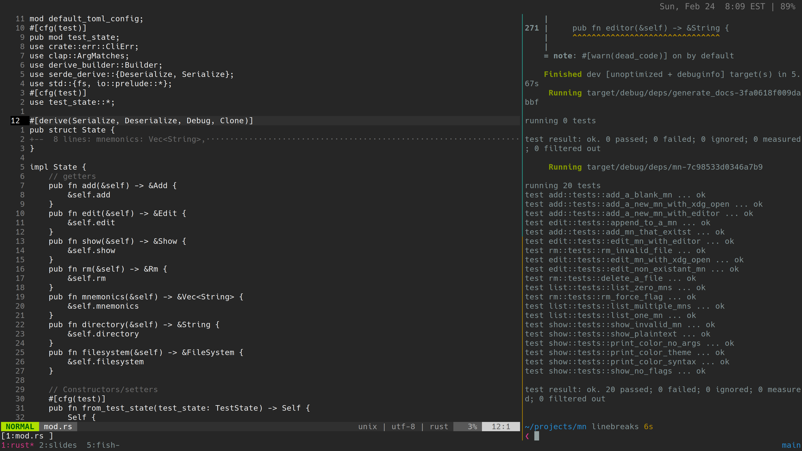
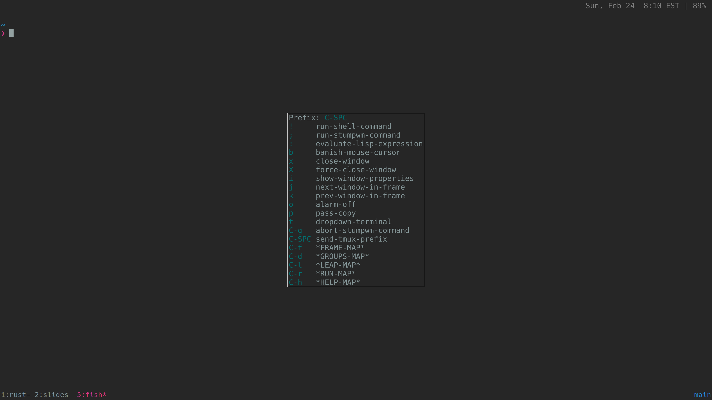

+++
title = "Screenshots from arch/stumpwm/tmux/vim/qutebrowser setup"
date = 2019-02-24
+++

I recently made a number of pretty significant change to the look and feel of my
Linux desktop environment, and I'm pretty happy with how my setup looks now.
It's not for everyone, but I thought at least some of y'all might be interested
in seeing how it looks.

## What I changed

I was previously using [dwm](https://dwm.suckless.org/) as my display manager—and, if you haven't tried it, I highly recommend it.  But I just 
switched to [stumpwm](https://stumpwm.github.io/), which sacrifices a bit in 
minimalism but makes up for it in configurability.  That change deserves—and
will get—it's own blog post.  But, for now, you'll just get to see the 
pictures.

At the same time, I've changed from a standard [Solarized](https://ethanschoonover.com/solarized/) color scheme for vim to the [nofrils](https://www.robertmelton.com/posts/syntax-highlighting-off/) color scheme as part of an experiment with removing (almost) all syntax highlight from my code.  That **also** deserves its own post; again, all you get right now is the 
screenshots.

The result of all of these changes is a highly **minimalist**, **distraction-free**, and **keyboard-centric** window setup—and I'm very happy with it for now.

## Screenshots

(In each case, click for a bigger image—and most of these really need it.) 

My main desktop, when I log in:

<!-- more -->

A full-screen terminal session open:

If I'm relaxing, I might be sending toots from [fosstodon](https://fosstodon.org)—and this setup lets me do this right from vim.

Of course, I'm never more than a key press away from a terminal—including a drop-down terminal if that breaks the workflow less

Enough relaxing—time to get some real work done:

And, if I ever need a reminder about the keys I've set up, stumpwm's built-in 
help is always there for me.

