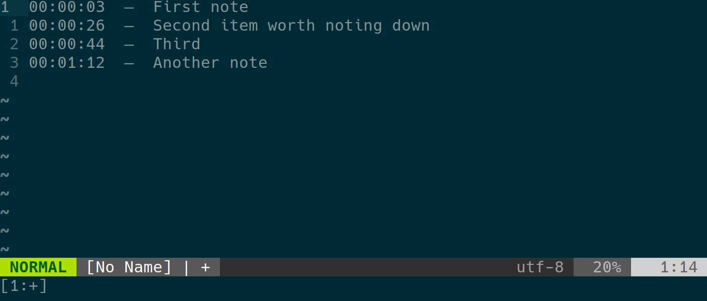

+++
title = "Using Vim to take time-stamped notes"
date = 2019-02-14
+++

I frequently find myself needing to take time-stamped notes.  Specifically, I'll
be in a call, meeting, or interview and need to take notes that show how long 
it's been since the meeting started.  Basically, I want something that looks
like this:



My first thought was that there's be a plugin to add time stamps, but a quick
search didn't turn anything up.  However, I little digging **did** turn up the
fact that vim has the built-in ability to tell time.

This means that writing a bit of vimscript to insert a time stamp is pretty
easy.  After a bit of fiddling, I came up with something that serves my needs, and I decided it might be useful enough to others to be worth sharing.  Here's what I came up with:

<!-- more -->

```vim
let g:time_stamp_enabled = 0
let g:time_stamp_start = 0
command! TimeStampToggle call TimeStampToggle()

function TimeStampToggle()
  let g:time_stamp_enabled = !g:time_stamp_enabled
  let g:time_stamp_start = strftime("%s") 
     " Time in seconds since the Unix epoch
endfunction

inoremap <expr> <CR> g:time_stamp_enabled ?\
   "\<ESC>:call TimeStamp()\<CR>a"\: "\<CR>"

function! TimeStamp()
     let l:current_sec = printf("%02d", strftime("%s") - g:time_stamp_start)
     let l:current_min = 0
     let l:current_hr  = 0

     while l:current_sec >= 60
       let l:current_sec -= 60
       let l:current_min += 1
     endwhile

     while l:current_min >= 60
       let l:current_min -= 60
       let l:current_hr  += 1
     endwhile

     let l:current_sec = printf("%02d", l:current_sec)
     let l:current_min = printf("%02d", l:current_min)
     let l:current_hr  = printf("%02d", l:current_hr)

     " Go to the beginning of the line,
     " print the current zero-padded time,
     " print `  -  ` as a separator
     " and move the cursor over for the next line (with separator)
     execute "normal! 0i\<SPACE>\<ESC>0dwi\
           \<C-R>=l:current_hr\<CR>:\<C-R>=l:current_min\<CR>:\<C-R>=l:current_sec \<CR>\
           \<SPACE>\<SPACE>—\<SPACE>\<SPACE>\<ESC>o\<SPACE>\<SPACE>\<SPACE>\<SPACE>\
           \<SPACE>\<SPACE>\<SPACE>\<SPACE>\<SPACE>\<SPACE>\<SPACE>\<SPACE>\<SPACE>"

 endfunction
 ```

This is made *slightly* more complicated than it needs to be by my desire for a
relative time stamp.  If you'd prefer an absolute time stamp, you could simplify it considerably:

```vim
let g:time_stamp_enabled = 0
command! TimeStampToggle let g:time_stamp_enabled = !g:time_stamp_enabled

inoremap <expr> <CR> g:time_stamp_enabled ? "\<ESC>:call TimeStamp()\<CR>a" : "\<CR>"

function! TimeStamp()
     let l:current_time = strftime("%H:%M:%S")
     execute "normal! 0i\<SPACE>\<ESC>0dwi\
          \<C-R>=l:current_time\<CR>\
          \<SPACE>\<SPACE>—\<SPACE>\<SPACE>\<ESC>o\<SPACE>\<SPACE>\<SPACE>\<SPACE>\
          \<SPACE>\<SPACE>\<SPACE>\<SPACE>\<SPACE>\<SPACE>\<SPACE>\<SPACE>\<SPACE>"

endfunction
```

This produces time stamps like `14:21:55`—and, of course, you can customize the time stamp to your own needs with the normal arguments to `strftime` (basically the same ones as `date`, but check `:help strftime()` for full details.)

<aside>
I thought about packaging this up as a plugin, but decided it's a bit too simple.  But feel free to copy this code into your own .vimrc—like the other code samples on this site, it's released under an MIT license
</aside>

So, vimscript will probably never win any beauty contests—and will **definitely** never be my favorite language.  But it can be pretty handy for wiping together quick utilities.


